# 시각장애인 실내 대피 AI 내비게이션 — 설계서

| 항목 | 내용 |
|---|---|
| 프로젝트명 | 시각장애인 실내 대피 AI 내비게이션 (fire-evac-nav) |
| 트랙 | AI트랙 (학술제 프로젝트) |
| 버전 | v1.0 |
| 작성일 | 2026-08-18 |
| 소속 | 가천대학교 (팀 gachonO2) |
| 저장소 | github.com/gachonO2/fire |

> 재난 때 "가까운 출구"를 알려주는 것이 아니라, 시각장애인이 **현재 위치에서 연기·혼잡·장애물을 피해 실제로 이동할 수 있는 경로**를 음성·진동으로 안내한다.

---

## 문서 정보

본 문서는 시각장애인 실내 대피 AI 내비게이션(fire-evac-nav) 개발을 위한 요구 규격 및 설계서이다.

| 버전 | 변경한 사람 | 변경한 날짜 | 변경(또는 추가) 내용 |
|---|---|---|---|
| 1.0 | 팀 gachonO2 | 2026-08-18 | 설계서 초안 작성 (구현 상태 기준 역설계 포함) |

※ 팀원 이름·학번은 팀 구성에 맞게 기입한다. (git 이력 기준 기여자: yushin55, Wonjun Jung)

---

## 목차

- **Ⅰ. 문제 정의 및 사용자 분석**
- **Ⅱ. 기술 스택 선정**
- **Ⅲ. 요구사항 분석**
- **Ⅳ. 서비스 설계**
- **Ⅴ. 화면 설계**
- **Ⅵ. 데이터 및 API 설계**
- **Ⅶ. AI 기능 설계**
- **Ⅷ. 개발 및 협업 계획**
- **Ⅸ. 보안 및 배포 계획**
- **참고문헌**

---

# Ⅰ. 문제 정의 및 사용자 분석

본 프로젝트는 화재 등 재난 상황에서 시각장애인이 **묻지 않아도 파악되는 현재 위치**로부터 **연기·과열·차단 구간을 피해 실제로 이동 가능한 경로**를 음성과 진동으로 안내하는 시스템이다. 본 장에서는 개발 배경과 문제 정의, 기존 접근의 한계, 사용자 분석, 개발 목표 및 범위, 용어 정의를 기술한다.

## 1.1 개발 배경 및 문제 정의

### 1.1.1 재난 대피 안내의 구조적 공백

건물의 피난 안내 체계(피난안내도·유도등·비상방송)는 **시각 정보 위주**로 설계되어 있다. 시각장애인은 다음 세 가지 정보를 스스로 얻기 어렵다.

| 문제 영역 | 구체적 현상 | 본 시스템의 대응 |
|---|---|---|
| 현재 위치 파악 | "지금 어디 계신가요"를 앱 목록에서 고르는 일은 눈으로는 1초지만 스크린리더로는 수십 번의 탭. 화재 상황에서 그 시간을 쓰게 해서는 안 된다 | BLE 비콘 최근접 판정으로 위치를 **묻지 않고** 스스로 알아낸다 |
| 정적 안내의 위험 | "가까운 출구"는 그 출구 방향에 연기·과열이 있으면 오히려 위험 | 관제 지정·온도 센서 판정을 통합한 **동적 경로 재탐색** (2초 이내) |
| 안내 전달 수단 | 화면·화살표는 전달되지 않고, 연속 음성은 화재경보·사람 목소리 같은 "청각적 시야"를 덮는다 | 6개 명령 체계의 짧은 음성 + 패턴 진동, 상태가 바뀔 때만 발화 |
| 통신 두절 | 화재 시 네트워크·전원 손실 가능 | 캐시된 지도·위험 상태로 **오프라인 폴백 계산** 지속 |
| 불확실성 은폐 | 틀린 방향을 자신 있게 알려주는 것은 아무것도 안 하는 것보다 위험 | 확신도 측정 → 기준(40%) 미달 시 임의 안내 중단 + 자동 구조요청 |

### 1.1.2 문제 정의문

> 시각장애인은 화재 시 (1) 자신의 위치를 빠르게 확정할 수 없고, (2) 위험이 반영되지 않은 정적 안내를 믿고 이동하다 위험 구간에 진입할 수 있으며, (3) 시각 매체 중심의 안내를 수신할 수 없다. 따라서 **위치 자동 판정 → 위험 반영 동적 경로 → 비시각 채널 안내 → 실패 시 구조요청**이 하나의 연속 흐름으로 제공되어야 한다.

### 1.1.3 관련 인프라 현실과 설계 방침

- 위치 인프라(비콘)·센서(온도)·건물 도면은 건물마다 없거나 제각각이다 → 지도는 하드코딩하지 않고 **도면 주입**으로, 센서·화재수신기는 **실제 게이트웨이가 호출하는 것과 동일한 API**로 열어 둔다 (시뮬레이션과 실연동의 경로를 분리하지 않는다).
- 공식 안전규칙·당사자 실증·책임/인증은 MVP 범위 밖 → 모의 데이터·시뮬레이션으로 대체하되 실연동 경로 2가지(도면 주입 `POST /api/plans`, 센서 `POST /api/sensors/*`)는 열어 둔다.

## 1.2 기존 접근(측위 기술)의 한계 — 배제 근거

측위 방식 선정 과정에서 검토 후 배제한 대안이다. 발표 시 비교 근거로 사용한다.

| 방식 | 배제 이유 |
|---|---|
| Wi-Fi RTT (802.11mc) | 정확도 1~2m로 가장 좋지만 **iOS 0%**, 안드로이드도 Pixel 위주. 802.11mc 지원 AP 교체 + 배선 공사에 수백만 원. 유선 전원 AP라 화재 정전 시 측위 전체가 죽는다 — 대피 시스템 인프라로 부적합 |
| RSSI 삼각측량 | 신호세기→거리 환산이 실내 반사·인체 감쇠로 3~10m 오차. 교과서용 |
| Wi-Fi 핑거프린팅 | 정확도 1~3m(Anyplace 방식)지만 사전 신호 측정이 노동집약적이고 환경 변화마다 재측정. 노드 단위 해상도에는 과투자 |
| UWB | 10~30cm 정확도지만 앵커 고가, 지원 폰 제한, 웹 API 없음 |
| QR 수동 체크인 | 확실하지만 사용자 행동 필요. 초기 위치 확정·데모 폴백용으로는 유효 (폴백으로 채택) |

**채택: BLE 비콘 최근접 판정.** RSSI를 거리로 환산하면 3~5m 오차로 실패하지만, "어느 비콘이 제일 가까운가"라는 **비교**에만 쓰면 그 오차에 견딘다. 대피 안내에 필요한 해상도는 노드 단위("302호 앞")이고, 최근접 판정이 정확히 그 해상도다. 비콘 사이 구간은 PDR(걸음감지·방위추적)로 메운다.

## 1.3 사용자 분석

### 1.3.1 액터/페르소나 정의

| 액터 | 유형 | 설명·니즈 |
|---|---|---|
| 시각장애인 대피자 | 주 액터 | VoiceOver/TalkBack 상시 사용. 화면을 더듬을 수 없는 대피 중에는 시스템이 **먼저 말을 걸어야** 한다. 골전도 이어폰 전제(귀를 막지 않아 화재경보·사람 목소리를 함께 들음) |
| 저시력자·동행자(가족·소방관) | 주 액터 | 큰 화살표·거리 표시·고대비 화면. 시각장애인과 **같은 정보의 이중화** 수신 |
| 관제 담당자 | 주 액터 | 위험 지정/해제, 온도 판독 모니터, SOS 대응, 재탐색 KPI 확인 |
| 보호자 | 주 액터 | 대피 시작 순간부터 위치·경로·안내 문구·상태를 실시간 확인, 상태 전이 시 알림 |
| 건축·도면 담당자 (및 일반 수집가) | 보조 액터 | 피난안내도 촬영·주입. 수집은 누구나, **활성화(안내 반영)는 관제만** |
| 화재수신기·BMS/온도 센서 게이트웨이 | 시스템 액터 | `POST /api/sensors/fire-panel`, `POST /api/sensors/temperature` 웹훅 호출 |
| BLE 비콘 | 시스템 액터 | 노드별 광고 신호. 미설치 건물은 가상 비콘(`SIM-<nodeId>`) 시뮬레이션 |
| AI 판독기 (YOLO 탐지기 + 언어모델) | 시스템 액터 | 피난안내도 사진 → 지점·통로 초안. 결과는 저장되지 않고 사람 확인을 거친다 |

### 1.3.2 사용자 여정 맵 (시각장애인 대피자)

| 여정 단계 | 사용자 행동 | 시스템 동작 | UX 목표 |
|---|---|---|---|
| ① 평상시 | (촬영 앱으로 도면 수집 참여 가능) | 피난안내도 촬영→AI 판독→초안 접수 | 데이터가 쌓이는 구조 |
| ② 경보 | 아무것도 하지 않음 | 화재 감지 → AlarmScreen이 화면 전체를 덮음 (사이렌·진동·음성·손전등) | 앱을 "찾게" 하지 않는다 |
| ③ 위치 확정 | 아무것도 하지 않음 | 비콘 최근접 판정 → `aria-live`로 "현재 위치는 301호 진료실 앞입니다" | 위치를 **묻지 않는다** |
| ④ 대피 시작 | 대피 시작 버튼 1회 | 긴 진동 1회 + "대피 모드를 시작합니다" → 접근 가능 최단 출구 안내 | 조작 최소화 |
| ⑤ 이동 | 안내를 따라 이동 | 구간별 "정면으로 9걸음…" + 회전 시 짧은 진동, 비콘 갱신으로 위치 마커 이동 | 상태가 바뀔 때만 발화 |
| ⑥ 위험 변화 | 없음 | 관제/센서 위험 → 2초 이내 재탐색 → "위험. 전방 통로 상태가 변경되었습니다" | 동적 경로 |
| ⑦ 실패 시 | 없음 | 접근 가능 경로 없음/확신도 미달 → 안전상태 전환 + 구조요청 자동 전송 | 불확실성을 숨기지 않는다 |
| ⑧ 보호자 | (사전 등록) | 보호자 화면에 🚨 배너·브라우저 알림 + 실시간 위치·경로·안내 문구 | 원격 안심·구조 연계 |

## 1.4 개발 목표 및 범위

### 1.4.1 프로젝트 비전 및 핵심 목표

- **묻지 않는 위치**: 비콘 최근접 판정으로 시작 화면에서 위치 선택 과정을 제거한다.
- **접근 가능한 동적 경로**: 관제 지정 + 센서 판정을 통합한 위험 상태로 Dijkstra 재탐색, 화재 시 엘리베이터 자동 제외.
- **비시각 안내 UX**: 음성·진동 6개 명령, 소리=방향(스테레오)·진동=세기 분담, 상태 변화 시에만 발화.
- **끊겨도 계속되는 안내**: 백엔드/네트워크 단절 시 캐시 지도·위험 상태로 오프라인 폴백 계산.
- **불확실성의 정직한 처리**: 확신도·나침반 안정도 기준 미달 시 안내 중단 + 구조요청. 틀린 방향을 자신 있게 알려주지 않는다.
- **도면 주입 파이프라인**: 건물 도면 사진 → AI 판독(탐지기+언어모델) → 사람 확인 → 활성화. 도면 하나 등록 **10분 → 1분**.

### 1.4.2 MVP 범위 (4주)

4주 MVP 범위는 **한 건물 한 층(병원 3층)의 모의대피 실험**이다. "완전 자율 대피"가 아니라 **접근 가능한 동적 경로 + 안내 UX 검증**이 목표다.

| 기능 영역 | 세부 기능 | MVP | 확장 | 비고 |
|---|---|---|---|---|
| 경로 | Dijkstra 접근가능 최단 출구 + 차단/엘리베이터 제외 | ☑ | — | 핵심 |
| 측위 | BLE 최근접 판정(스무딩·히스테리시스·그래프 제약) | ☑ | — | 기기 없이 시뮬레이션 검증 |
| 측위 | 실기기 BLE 스캔 (Web Bluetooth 플래그 / 네이티브) | △ 데모 1대 | ☑ | 수신 제약 참조 |
| 위험 | 관제 지정 + 온도 센서 임계 판정 + 병합 | ☑ | — | 핵심 |
| 위험 | 실제 화재수신기·BMS 연동 | 규격만 | ☑ | 웹훅 자리 마련 |
| 안내 | 음성·진동 6개 명령, 확신도, 안전상태·SOS | ☑ | — | 핵심 |
| 도면 | 편집기 수동 작성 + JSON 가져오기 + AI 판독 | ☑ | — | 핵심 |
| 도면 | 모바일 촬영→draft 접수→확인→활성화 | ☑ | — | 핵심 |
| 보호자 | 등록·공유 코드·실시간 화면·상태 알림 | ☑ | 본인확인·코드 만료·철회 | 개인정보 경계 참조 |
| 관제 | 대시보드(화재·온도 시뮬레이션, SOS, KPI) | ☑ | — | 핵심 |
| 다층·다건물 | 층간 이동, 여러 건물 동시 운영 | — | ☑ | v2.0+ |
| 인증 | 재난안전 인증·당사자 실증 | — | ☑ | 안전 고지 참조 |

### 1.4.3 검증 가설 (성능·품질 목표)

| # | 가설 | 측정 방법 | 목표 |
|---|---|---|---|
| ① | 진동+음성 병행 안내는 6개 명령 규칙으로 이해된다 | 모의대피 관찰·설문 | 명령 오해 없이 경로 완주 |
| ② | 시스템은 불확실성을 감지해 스스로 멈출 수 있다 | 경로 이탈 재현 → 확신도 40% 미달 시 중단+SOS | 오안내 지속 0건 |
| ③ | 위험 변화 후 재탐색은 2초 이내 | 관제 KPI 패널에 ms 기록 (`/api/metrics`) | ≤ 2,000ms (실측 0.8ms 수준) |
| ④ | 관제·유지관리 관점의 가치가 있다 | 대시보드·센서 웹훅·판독 끊김 표시 시연 | 관제 시나리오 완주 |

## 1.5 용어 정의

| 용어/약어 | 정의 | 사용 맥락 |
|---|---|---|
| FloorPlan | 노드·통로·축척·방위·이미지로 구성된 층 도면 모델 (`shared/floor-plan.js`) | 지도 그래프의 단일 진실 소스 |
| 노드(node) | 도면 위 지점. 유형: `room` `junction` `exit` `elevator` `stair` | `exit`가 대피 목표 |
| 엣지(edge) | 두 노드를 잇는 통로. `wall`(좌/우 따라갈 벽) 속성 | 위험 지정·차단 단위 |
| metersPerUnit | 도면 1px가 실제 몇 m인가 (축척) | "몇 걸음" 계산의 근거. **사람이 직접 입력** |
| stepLength | 보폭(m). 거리→걸음 수 변환 | 기본 0.7m |
| northOffset | 도면 위쪽이 실제 몇 도(자북 기준)를 향하는가 | 진동 방향 안내의 전제. **빈 칸과 0(북)은 다른 값** |
| 도면 방위/실제 방위 | 도면 위쪽=0인 각도 / 자북=0인 각도 | 둘을 잇는 값이 northOffset |
| RSSI | BLE 수신 신호 세기(dBm). 정지 상태에서도 ±10dB 요동 | 거리 환산이 아닌 **최근접 비교**에만 사용 |
| 히스테리시스 | 현재 노드 전환에 "5dB 이상 세게 + 2초 지속" 조건을 거는 것 | 노드 경계 깜빡임 방지 |
| PDR | Pedestrian Dead Reckoning — 걸음 감지·방위 추적으로 위치 추정 | 비콘 사이 구간 보간 (`odometry.js`) |
| 확신도 | 걸음·방위 누적으로 계산한 위치 신뢰도. 40% 미달 시 안내 중단 | 불확실성 안전장치 |
| 가상 비콘 | 비콘 미설치 도면에서 지점마다 있다고 가정하는 `SIM-<nodeId>` 비콘 | 화면에 "(가상 비콘 시뮬레이션)" 표기 |
| SSE | Server-Sent Events — 서버→클라이언트 실시간 push | `GET /api/stream` |
| draft(초안) | 앱에서 접수된 미확인 도면. **활성화 불가(409)** | "누구나 내고, 확인은 담당자가" |
| 활성화(activate) | 해당 도면으로 안내를 시작하는 것. 관제 권한 필요 | 열려 있는 모든 화면에 SSE로 전파 |
| hazard | 통행 불가/회피 대상 위험 상태 (관제 지정 + 센서 판정 병합) | `shared/hazard-rules.js` |
| SOS | 구조요청. 보호자 연락처 자동 첨부 | 안전상태 전환 시 자동 전송 |
| aria-live | 화면 변경을 스크린리더가 즉시 읽게 하는 웹 접근성 속성 | 위치 판정 결과 즉시 낭독 |
| TTS | Text-to-Speech 음성 합성 | `guidance.js`, `expo-speech` |
| YOLO | 실시간 객체 탐지 모델. 피난안내도 기호 탐지에 두 벌 사용 | `ml/detector` |
| NMS | Non-Maximum Suppression — 중복 탐지 상자 정리 | 클래스별 적용 |
| Anyplace | Univ. of Cyprus DMSL의 실내 측위 오픈소스(MIT). POI/Connection 그래프·Dijkstra 포팅 원본 | `shared/pathfinding.js` |
| PWA | Progressive Web App — 설치·오프라인 가능한 웹 앱 | `frontend/` + `sw.js` |
| Expo Go | React Native 앱을 빌드 없이 실행하는 런타임. BLE 스캔·연속 진동 불가 제약 | `mobile/` |

---

# Ⅱ. 기술 스택 선정

## 2.1 선정 원칙

| 원칙 | 내용 |
|---|---|
| 안전 우선 | 오안내는 곧 인명위험. 계산 권위를 서버 한 곳에 두고, 불확실하면 멈춘다 |
| 오프라인 내성 | 화재 시 통신 두절 전제. 프론트가 같은 알고리즘으로 폴백 계산 가능해야 한다 |
| 비용 0 데모 | 비콘·센서 없이 전 기능이 시뮬레이션으로 검증 가능해야 한다 (같은 API 경유) |
| 실연동 경로 | 시뮬레이션과 실제 연동이 **같은 엔드포인트**를 쓴다 — 실증에서 배선만 바꾼다 |
| 접근성 내장 | 프레임워크 추상화보다 aria-live·TTS·진동 API 직접 제어가 유리 |

## 2.2 계층별 선정 결과 및 근거

| 계층 | 선정 | 근거 | 배제한 대안 |
|---|---|---|---|
| 사용자/관제/보호자/편집기 | **순수 JS PWA** (프레임워크 없음) | 빌드 없이 즉시 실행·디버깅, aria-live/SW/TTS 직접 제어, 4주 MVP에 러닝커브 0 | React/Vue(빌드 파이프라인·추상화 비용), 네이티브 전면 전환(수집·관제까지 앱화는 과투자) |
| 모바일(iOS) | **Expo(React Native)** — Expo Go 실행 | Xcode 없이 아이폰 실기기 테스트(`exp://` 접속), 카메라·햅틱·센서·TTS 모듈 완비 | Swift 네이티브(빌드 환경 필요), 웹뷰(카메라·햅틱 제약) |
| 백엔드 | **Node.js 20 + Express 4** | `shared/` 알고리즘을 프론트와 **같은 언어로 공유**(단일 진실 소스), SSE 간단 구현 | Python 서버(경로탐색 코드 이원화), Firebase Functions 단독(SSE·디버깅 불리) |
| DB | **Firestore (firebase-admin 12)** + 인메모리 폴백 | 서버리스 무료 티어, 백엔드 전용 접근으로 보안 규칙 단순화("전부 차단") | RDBMS(서버 운영 부담), 클라이언트 SDK 직접 접근(자격증명 노출 — 9장 참조) |
| 실시간 전파 | **SSE** (`GET /api/stream`) | 단방향 push면 충분, HTTP 그대로라 프록시·같은 출처 구성이 쉬움, 자동 재연결 | WebSocket(양방향 불필요·인프라 복잡), 폴링(2초 목표에 낭비) |
| 경로탐색 | **Dijkstra** (Anyplace 포팅) | 노드 수십 규모에 최적해 보장, 차단엣지·가중치 회피 구현 단순 | A*(휴리스틱 이득 미미), 상용 지도 SDK(실내 그래프 미지원) |
| 측위 | **BLE 비콘 최근접 판정** + PDR 보조 | 1.2절 비교표 참조 — 노드 단위 해상도에 정확히 부합, 배터리 비콘이라 정전에도 생존 | Wi-Fi RTT/UWB/핑거프린팅/삼각측량 (1.2절) |
| 기호 탐지 | **YOLO 2벌 + FastAPI(파이썬, 별도 프로세스)** | 피난안내도로 직접 학습한 도메인 특화 탐지. 별도 프로세스라 꺼져 있어도 본체 무영향 | 단일 모델 8클래스(클래스 상호 간섭으로 분리), 범용 OCR(기호 인식 불가) |
| 도면 이해(언어) | **언어모델 — Gemini(우선)/Claude** | 도면의 이름·통로 연결을 읽는다. Google 직접 연결 권장(게이트웨이 이미지 유실 방지) | 언어모델 단독 좌표 판독(수십 px 오차 — 좌표는 탐지기 담당) |
| 지도 렌더링 | **SVG 직접 그리기** (`minimap.js`) | 도면 배경+노드·엣지·온도 배지 합성이 단순, 의존성 0 | Canvas 지도 라이브러리(과투자) |

## 2.3 실시간 전파 방식 비교 (상세)

| 비교 항목 | SSE ☑ 채택 | WebSocket | 폴링 |
|---|---|---|---|
| 방향 | 서버→클라 단방향 (요구와 일치) | 양방향 (불필요) | 클라 주도 |
| 프록시/같은 출처 | HTTP 그대로 — dev 프록시로 CORS 없이 통과 | 업그레이드 협상 필요 | 통과 |
| 재연결 | 브라우저 내장 자동 재연결 | 직접 구현 | 해당 없음 |
| 스코프 제한 | `?code=` 쿼리로 보호자 범위 제한 용이 | 가능하나 프로토콜 설계 필요 | 가능 |
| 2초 재탐색 목표 | 즉시 push | 즉시 push | 주기에 종속 |

## 2.4 프레임워크 및 핵심 라이브러리 버전

| 기술/라이브러리 | 버전 | 용도 | 위치 |
|---|---|---|---|
| Node.js | ≥ 20 (engines 고정) | 백엔드·개발 서버·테스트 러너 | 루트/`backend/` |
| Express | ^4.19.2 | REST API·정적 서빙·SSE | `backend/` |
| firebase-admin | ^12.3.0 | Firestore 서비스 계정 접근 | `backend/` |
| cors | ^2.8.5 | 교차 출처 허용(개발) | `backend/` |
| dotenv | ^16.4.5 | `.env` 환경변수 | `backend/` |
| Expo | ~54.0.0 | 모바일 런타임 | `mobile/` |
| React / React Native | 19.1.0 / 0.81.5 | 모바일 UI | `mobile/` |
| expo-camera / image-picker / image-manipulator / file-system | ~17.0 / ~17.0 / ~14.0 / ~19.0 | 도면 촬영·갤러리·압축·저장 | `mobile/` |
| expo-haptics / sensors / speech / audio / location | ~15.0 / ~15.0 / ~14.0 / ~1.1 / ~19.0 | 진동·가속도/자력계·TTS·합성음·위치 | `mobile/` |
| react-native-svg | 15.12.1 | 모바일 지도·화살표 렌더링 | `mobile/` |
| Python + FastAPI + uvicorn | 3.x / 최신 | 기호 탐지기 HTTP 서비스 | `ml/detector/` |
| Ultralytics YOLO (torch) | `.pt` 가중치 2벌 | 도면 기호 탐지 (GPU 자동 사용) | `ml/detector/models/` |
| Gemini API | `gemini-2.5-flash` 기본 | 도면 이름·통로 판독 (무료 키) | `backend/planReader/providers.js` |
| Anthropic API | `claude-opus-5` 등 | 동일 (대체 공급자) | 〃 |

## 2.5 오픈소스 재사용 (MIT)

| 오픈소스 | 가져온 것 | 반영 위치 |
|---|---|---|
| **Anyplace** (Univ. of Cyprus DMSL) | POI/Connection 그래프 모델, `Dijkstra.scala` 경로탐색 | `shared/pathfinding.js`로 포팅 |
| **Visual_Slam** (Prototype/Academic) | PWA 구조, devicemotion 걸음감지·방위추적, TTS·진동 접근성 모듈 | `frontend/js/odometry.js` 등 참고 |

오픈소스로 해결되지 않는 부분(공식 안전규칙, 위치 인프라, 당사자 실증, 책임·인증)은 MVP에서 **모의 데이터·시뮬레이션**으로 대체했다. 원본은 `vendor/`에 보존한다.

---

# Ⅲ. 요구사항 분석

## 3.1 서비스 개요 및 핵심 컨셉

| 컨셉 | 설명 | 차별점 |
|---|---|---|
| 묻지 않는 위치 | 비콘 판정 결과를 aria-live로 즉시 낭독, 대피 시작 버튼 개방. QR·목록 선택은 `<details>` 폴백 | 스크린리더 탐색 시간 제거 |
| 서버 권위 계산 | 출구·통로 선택, 위험 제외, 화재 판정은 전부 서버. 앱·화면은 전달만 | 관제와 앱이 다른 말을 하지 않는다 |
| 오프라인 폴백 | 서버 단절 시 프론트가 캐시 지도·위험으로 같은 코드(`shared/`)로 직접 계산. 배지 "오프라인" 표시 | 안내가 끊기지 않는다 |
| 이중화 UX | 같은 정보를 시각(화살표·고대비)과 비시각(음성·진동)에 동시 제공 | 동행자·저시력자 포함 |
| 사람 확인 최종 방어선 | AI 판독 결과는 저장되지 않고 편집기에 올라올 뿐. 저장·활성화는 사람이 | 비상구 오검출이 안내에 직행하지 않는다 |
| 실연동 동일 경로 | 관제 시뮬레이션 도구가 실제 센서·수신기와 **같은 API**를 호출 | 실증 시 배선만 교체 |

## 3.2 유스케이스 모델

### 3.2.1 유스케이스 목록

| UC ID | 유스케이스명 | 주 액터 | 전제 조건 | 성공 시 사후 조건 |
|---|---|---|---|---|
| UC-01 | 현재 위치 자동 판정 | 시스템(비콘) | 활성 도면 존재 | 현재 노드 확정, aria-live 낭독 |
| UC-02 | 대피 시작 | 대피자 | 위치 확정(또는 폴백 선택) | 접근가능 최단 출구 경로 안내 개시, 보호자 알림 |
| UC-03 | 구간 안내 수신 | 대피자 | 안내 중 | 음성+진동 명령 전달, 걸음 수 갱신 |
| UC-04 | 위험 변화 재탐색 | 시스템 | 안내 중, 위험 상태 변경 | 2초 이내 새 경로 + "위험" 명령 |
| UC-05 | 접근 불가 → 안전상태 | 시스템 | 모든 출구 경로 차단 | 안내 중단, 구조요청 자동 전송 |
| UC-06 | 경로 이탈 감지 | 시스템 | 안내 중 | 확신도 하락, 40% 미달 시 UC-05 연계 |
| UC-07 | 오프라인 전환 | 시스템 | 백엔드 단절 | 배지 "오프라인", 캐시 기반 안내 지속 |
| UC-08 | 위험 지정/해제 | 관제 | 관제 인증(ADMIN_TOKEN) | hazards 갱신, 전 화면 SSE 전파 |
| UC-09 | 온도 판독 수집 | 센서/관제 | — | 임계 판정(60/45°C) → 자동 회피·배지 표시 |
| UC-10 | SOS 접수·대응 | 관제 | SOS 발생 | SOS 카드에 보호자 연락처 표시 |
| UC-11 | 보호자 등록 | 대피자 | 대피 전 | 6자리 공유 코드·링크 발급 |
| UC-12 | 보호자 실시간 관찰 | 보호자 | 코드 입력 | 위치·경로·안내 문구·상태 배너 실시간 표시 |
| UC-13 | 도면 촬영·접수 | 수집가(앱) | — | draft 저장(안내 미사용), 편집기에 "확인 필요" 표시 |
| UC-14 | 도면 AI 판독 | 편집자 | 탐지기/언어모델 중 1 이상 | 지점·통로 초안 + 신뢰도·경고 표시 |
| UC-15 | 도면 확인·저장·활성화 | 편집자/관제 | 검증 통과 | 활성 도면 교체, 전 화면 SSE 전파 |
| UC-16 | 도면 JSON 가져오기 | 편집자 | 형식 적합 | `POST /api/plans` 동일 형식 주입 |
| UC-17 | 재탐색 KPI 기록 | 시스템 | 재탐색 발생 | `/api/metrics`에 ms 기록, 관제 패널 표시 |

### 3.2.2 핵심 유스케이스 상세 — UC-02 대피 시작

| 항목 | 내용 |
|---|---|
| 액터 | 시각장애인 대피자 |
| 전제 조건 | 활성 도면 로드, 현재 노드 확정(UC-01) 또는 폴백 선택 |
| 주 흐름 | 1. 대피 시작 탭 → 2. 긴 진동 1회 + "대피 모드를 시작합니다" → 3. `POST /api/route {from, kind:'fire'}` → 4. 접근가능 최단 출구 경로 수신 → 5. 첫 구간 명령(직진/회전) 발화 → 6. 위치 갱신마다 구간 진행 → 7. 출구 도착 판정 → "대피 완료" |
| 대안 흐름 | 3a. 서버 단절 → 오프라인 폴백 계산(UC-07) / 6a. 위험 변화 → 재탐색(UC-04) |
| 예외 흐름 | 4a. `route: null`(안전한 길 없음) → 안전상태 + SOS(UC-05) / 6b. 확신도 40% 미달 → 안내 중단 + SOS |
| 사후 조건 | 보호자 알림("대피를 시작했습니다"), positions 상태 갱신, 상황 기록 |

### 3.2.3 핵심 유스케이스 상세 — UC-13 도면 촬영·접수 (모바일)

| 항목 | 내용 |
|---|---|
| 액터 | 도면 수집가 (앱 사용자 누구나 — 관제 권한 불요) |
| 주 흐름 | 1. CaptureScreen에서 촬영(정렬 판정: 사각 틀, 맞으면 초록 테두리+확인음) → 2. ReviewScreen에서 확인(손가락·반사광은 찍은 뒤에만 안다) → 3. SubmitScreen에서 가로 폭(m) 입력 + **방위를 나침반으로 직접 측정** → 4. `POST /api/plans/draft` → 5. 서버가 사진 저장+AI 판독+초안 생성 일괄 수행 → 6. 편집기 목록에 "📱 앱에서 접수 · 확인 필요" 표시 |
| 예외 흐름 | 갤러리 사진은 `looksLikePlan` 거친 필터로 명백히 아닌 것만 거르고, 애매하면 사용자에게 묻는다 (판별 AI 학습용 데이터를 모으는 중이라 엄격하면 데이터가 안 쌓인다) |
| 안전 경계 | draft 상태로는 `activate`가 **409로 거부**된다. 사람이 편집기에서 저장해야 draft가 벗겨진다 |

## 3.3 기능 요구사항 (FR)

### FR-POS: 측위

| ID | 요구사항 |
|---|---|
| FR-POS-01 | BLE 스캔 결과(`{beaconId, rssi, ts}` 배열)에서 최근접 비콘의 노드를 현재 위치로 판정한다 |
| FR-POS-02 | 원시 RSSI에 3초 이동평균 스무딩을 적용한다 (정지 상태에서도 ±10dB 요동) |
| FR-POS-03 | 노드 전환은 기존보다 5dB 이상 세게 2초 지속될 때만 허용한다 (히스테리시스) |
| FR-POS-04 | 그래프에서 인접하지 않은 노드로의 전환은 유지 시간 ×2를 요구한다 (반사 허상 억제) |
| FR-POS-05 | 신호 전멸 시 마지막 위치를 유지한다 — 위치를 비우면 안내가 통째로 끊긴다 |
| FR-POS-06 | 확정 전(`locked=false`) 잠정값은 사용자에게 알리지 않는다 |
| FR-POS-07 | `onLocate`는 지점 변경 시뿐 아니라 **최초 확정 순간**에도 발화한다 |
| FR-POS-08 | 비콘 id가 없는 도면은 지점마다 가상 비콘(`SIM-<nodeId>`, 엘리베이터 제외)으로 시뮬레이션하고 화면에 표기한다 |
| FR-POS-09 | 비콘 사이 구간은 PDR(걸음·방위)로 추정을 잇고, 비콘 확정 시 누적오차를 리셋한다 |
| FR-POS-10 | 측위 계층은 시간을 인자로 받고 `Date.now()`를 직접 부르지 않는다 (테스트 가능성) |

### FR-NAV: 경로·안내

| ID | 요구사항 |
|---|---|
| FR-NAV-01 | `routeToNearestExit(floorPlan, fromId, hazards)`로 접근 가능한 최단 출구 경로를 계산한다 |
| FR-NAV-02 | 화재 모드에서 `elevator: true` 통로를 자동 제외한다 |
| FR-NAV-03 | 차단(과열·화재·연기) 엣지는 그래프에서 제외하고, 온도 상승(45°C~) 엣지는 가중치 ×4로 회피한다 |
| FR-NAV-04 | 위험 상태 변경 수신 후 2초 이내 재탐색하고 소요 ms를 KPI로 기록한다 |
| FR-NAV-05 | 접근 가능 경로가 없으면(`route: null`) 안전상태로 전환하고 구조요청을 자동 전송한다 |
| FR-NAV-06 | 안내 명령은 6개(직진/우회전/좌회전/멈춤/위험/구조요청)로 제한하고 각각 고유 진동 패턴을 갖는다 |
| FR-NAV-07 | 거리는 축척·보폭으로 걸음 수로 변환해 안내한다 ("정면으로 9걸음") |
| FR-NAV-08 | 따라갈 벽(좌/우)을 함께 안내한다 ("오른쪽 벽을 따라가세요") |
| FR-NAV-09 | 확신도 40% 미달 시 임의 안내를 중단하고 구조요청한다 |

### FR-HAZ: 위험 관리

| ID | 요구사항 |
|---|---|
| FR-HAZ-01 | 관제는 통로 단위로 위험을 지정/해제할 수 있다 (`PUT/DELETE /api/hazards/:edgeId`, 인증 필요) |
| FR-HAZ-02 | 온도 판독값은 통로(edgeId) 또는 지점(nodeId)에 붙는다 |
| FR-HAZ-03 | 60°C 이상 과열은 통행 불가, 45°C 이상은 가중치 회피, 60초 이상 미갱신 판독은 신뢰하지 않는다 |
| FR-HAZ-04 | 지점 센서 과열 시 그 지점에 연결된 **모든 통로**를 막는다 |
| FR-HAZ-05 | 관제 지정과 센서 판정이 겹치면 **더 심각한 쪽**을 채택한다 (센서 정상이 관제 차단을 열지 않는다) |
| FR-HAZ-06 | 관제 직접 지정분은 감사용으로 따로 조회 가능하다 (`GET /api/hazards/manual`) |
| FR-HAZ-07 | 화재수신기·BMS 웹훅 자리를 제공한다 (`POST /api/sensors/fire-panel`) |

### FR-PLAN: 도면 관리·판독

| ID | 요구사항 |
|---|---|
| FR-PLAN-01 | 도면 이미지 업로드 시 브라우저에서 자동 축소·압축한다 (900KB 이하) |
| FR-PLAN-02 | 층의 실제 가로 폭(m) 입력으로 축척을 자동 계산한다. **축척은 AI가 판독하지 않는다** |
| FR-PLAN-03 | 지점 5유형·통로(따라갈 벽 포함)를 편집·저장하고, JSON 가져오기를 지원한다 |
| FR-PLAN-04 | 저장 시 검증한다 — 출구 없음/없는 지점을 잇는 통로/id 중복은 **거부**, 고립 지점은 경고 |
| FR-PLAN-05 | 같은 비콘 id를 두 지점에 붙이면 저장을 거부한다 |
| FR-PLAN-06 | 활성화 시 열려 있는 모든 화면이 SSE로 즉시 새 도면을 받는다 |
| FR-PLAN-07 | 앱 접수 초안(draft)은 활성화를 409로 거부하고, 사람 저장 후에만 활성화 가능하다 |
| FR-PLAN-08 | AI 판독은 탐지기·언어모델 중 붙어 있는 조합으로 동작하고, 어느 조합으로 읽었는지 화면에 밝힌다 |
| FR-PLAN-09 | 판독 결과는 신뢰도(high/medium/low)·메모·경고와 함께 반환하고, 버린 항목은 무엇을 버렸는지 알린다 |
| FR-PLAN-10 | `exit`가 하나도 없으면 `stair`를 승격하되 경고한다. `room`이 없으면 경고한다 |
| FR-PLAN-11 | northOffset은 앱이 나침반으로 직접 잰다. 없으면 진동 방향 안내를 끈다 (좌우 회전 안내는 유지) |

### FR-GRD: 보호자

| ID | 요구사항 |
|---|---|
| FR-GRD-01 | 대피 전 보호자 등록(이름·연락처) 시 6자리 공유 코드·링크를 발급한다 |
| FR-GRD-02 | 보호자 화면에 상태 배너(대기/대피 중/구조 요청/대피 완료)+브라우저 알림·진동을 제공한다 |
| FR-GRD-03 | 지도 위 대상자 위치·안내 경로·위험 통로·**지금 듣고 있는 음성 안내 그대로**·확신도·목표 출구·남은 걸음 수·상황 기록을 실시간 표시한다 |
| FR-GRD-04 | 알림은 상태가 **바뀌는 순간에만** 울린다 (걸음마다 울리면 보호자가 알림을 꺼버린다) |
| FR-GRD-05 | SOS 발생 시 관제 SOS 카드에 보호자 이름·연락처를 함께 표시한다 |
| FR-GRD-06 | 보호자 스트림은 `?code=` 스코프로 제한한다 — 다른 대피자 위치·운영 지표는 전달하지 않는다 |

### FR-ADM: 관제 대시보드

| ID | 요구사항 |
|---|---|
| FR-ADM-01 | 지도에서 통로/지점 클릭으로 화재·온도(🌡️)를 주입한다 — 실제 센서와 같은 API 경유 |
| FR-ADM-02 | 판독값 목록(임계 판정·노후 여부)과 지도 온도 배지, 끊긴 센서 흐림 `⚠` 표시 |
| FR-ADM-03 | SOS 모니터, 재탐색 KPI(ms) 패널, 시나리오 초기화(↺) 제공 |
| FR-ADM-04 | 대피자 위치·상태 목록 실시간 표시 |

### FR-MOB: 모바일 앱 고유

| ID | 요구사항 |
|---|---|
| FR-MOB-01 | 화재 감지 시 AlarmScreen이 화면 전체를 덮는다 (사이렌·진동·음성·손전등). 사용자가 열지 않아도 스스로 열린다 |
| FR-MOB-02 | 소리(스테레오 좌우)가 방향을, 진동이 세기를 맡는다. 진동 세기는 진폭×빈도로 합성한다 |
| FR-MOB-03 | 나침반 안정도(`stability`)가 기준(`STABILITY_FLOOR`) 미달이면 안내를 멈추고 경고한다 |
| FR-MOB-04 | 서버 단절 시 demoPlan·로컬 pathfinding으로 폴백하되, 폴백 사실을 음성·화면으로 반드시 알린다 |
| FR-MOB-05 | VoiceOver를 대체하지 않고 활용한다 — accessibilityLabel + `announceForAccessibility()` 선제 발화 |
| FR-MOB-06 | 상태가 바뀔 때만 말한다. 상황 요약은 30초에 1회. **연속 배경음 금지** |
| FR-MOB-07 | 서버 주소는 Expo 개발 서버 호스트에서 알아낸다 (IP 하드코딩 금지). 배포 시 `EXPO_PUBLIC_FIRE_SERVER` |

## 3.4 비기능 요구사항 (NFR)

| ID | 분류 | 요구사항 | 목표값 | 검증 방법 |
|---|---|---|---|---|
| NFR-PERF-01 | 성능 | 위험 변화 → 재탐색 완료 | ≤ 2초 (계산 자체 ~0.8ms) | KPI 패널 실측 (`/api/metrics`) |
| NFR-PERF-02 | 성능 | AI 판독 소요 | 탐지기 CPU 3.5초(1100×744)~15초, LLM 15~19초 | 실측 기록 (Ⅶ장) |
| NFR-AVAIL-01 | 가용성 | 백엔드 단절 시 안내 지속 | 오프라인 폴백 100% | 백엔드 종료 후 시연 (데모 5단계) |
| NFR-AVAIL-02 | 가용성 | Firebase 미설정 시 동작 | 인메모리 저장소로 전 기능 | `npm run dev`만으로 시연 |
| NFR-AVAIL-03 | 가용성 | 탐지기/LLM 부재 시 도면 등록 | 손으로 그리기로 계속 | 조합 4상태 시험 |
| NFR-ACC-01 | 접근성 | 위치 판정 즉시 낭독 | aria-live 적용 | 스크린리더 확인 |
| NFR-ACC-02 | 접근성 | 발화 억제 규칙 | 상태 변화 시만, 요약 30초 1회 | 코드·시연 확인 |
| NFR-SEC-01 | 보안 | 클라이언트의 Firestore 직접 접근 | 0건 (rules 전면 차단) | `firestore.rules` 검증 |
| NFR-SEC-02 | 보안 | 위험 쓰기 통제 | ADMIN_TOKEN 헤더 필수(설정 시) | 401/403 확인 |
| NFR-SEC-03 | 보안 | AI 게이트웨이 이미지 유실 감지 | 시야 점검 실패 시 판독 거부(503) | Ⅶ.6 검사 |
| NFR-TEST-01 | 품질 | 자동 테스트 | 경로·도면·온도 30종 + API 56종 + 측위·판독 그래프 | `npm test` |
| NFR-TEST-02 | 품질 | 시뮬레이션 노이즈 수준 | 실측 수준(±6dB, 유실 15%) 미만 금지 | `beacon-sim` 파라미터 |
| NFR-OPS-01 | 운영 | 포트 충돌 시 개발 서버 생존 | 기존 실행 안내 또는 다음 포트 이동 | dev-server 동작 |

## 3.5 시스템 제약 사항

| 유형 | ID | 제약 내용 |
|---|---|---|
| 기술 | TC-01 | Web Bluetooth Scanning API는 안드로이드 크롬 실험 플래그(`chrome://flags`) 뒤, iOS Safari는 미지원 → 웹 데모는 플래그 켠 안드로이드 크롬 1대. 대안: RSSI 중계 초소형 네이티브 앱 또는 ESP32 스캐너 |
| 기술 | TC-02 | Expo Go에서 BLE 스캔 불가(`react-native-ble-plx`+개발 빌드 필요) → 모바일 측위는 가상 비콘 시뮬레이션, 실기기 전환점은 `beaconLocator.js scanOnce()` 한 곳 |
| 기술 | TC-03 | 폰 진동 모터는 하나 — "왼쪽만 진동"은 물리적으로 불가능 → 방향은 시간축(폰을 돌리면 신호가 세짐, '나의 찾기' 원리)으로 |
| 기술 | TC-04 | Expo Go 햅틱은 5단계 프리셋뿐(연속 세기 불가) → 진폭×빈도 합성으로 대체, 네이티브 전환 시 `haptics.js setEngine()`에 꽂는다 |
| 기술 | TC-05 | 실내 나침반 신뢰성 미검증(철골·전선·엘리베이터 자기장 왜곡) — **가장 큰 리스크**. 안정도 미달 시 안내 중단 안전장치는 어떤 개선에도 유지 |
| 데이터 | DC-01 | 축척(가로 폭 m)은 사람이 직접 입력 — AI 어림 금지 (두 배 틀리면 "8m 직진"이 16m가 된다) |
| 데이터 | DC-02 | northOffset의 빈 칸과 0(북)은 다른 값 — 모르는 걸 0으로 저장 금지 |
| 데이터 | DC-03 | 없는 통로를 만들지 않는다 — 끊긴 곳은 끊겼다고 알린다 (벽으로 걷게 만들지 않는다) |
| 법·윤리 | LC-01 | 본 소프트웨어는 모의대피 실험·UX 검증용 프로토타입이며 재난안전 인증 제품이 아니다. 실제 화재 대응 용도 사용 금지 |
| 일정 | SC-01 | 4주 MVP. 한 건물 한 층(병원 3층) 모의대피 |

## 3.6 데이터 요구사항

| 데이터 유형 | 저장 위치 | 개인정보 | 비고 |
|---|---|---|---|
| 도면(그래프·이미지 data URI) | Firestore `plans` (또는 인메모리) | ☒ | 이미지 900KB 이하 압축 |
| 위험 상태(관제 지정) | Firestore `hazards` | ☒ | 감사용 manual 구분 |
| 온도 판독값 | 서버 상태(+스트림) | ☒ | 60초 노후 판정 |
| 대피자 위치·상태 | Firestore `positions` | △ (userId) | 상태 전이 시 알림 생성 |
| 구조요청(SOS) | Firestore `sos` | △ (보호자 연락처 첨부) | 관제 카드 표시 |
| 보호자(이름·연락처·코드) | Firestore `guardians` | ☑ | 코드 스코프 제한, Ⅸ장 |
| 알림 이력 | Firestore `alerts` | △ | 상태 전이 시만 생성 |
| 재탐색 KPI | Firestore `metrics` | ☒ | ms 단위 |
| AI 학습용 도면 사진 | 서버 저장(draft 경유) | ☒ | 판별 모델 학습 재료 |

---

# Ⅳ. 서비스 설계

## 4.1 시스템 아키텍처

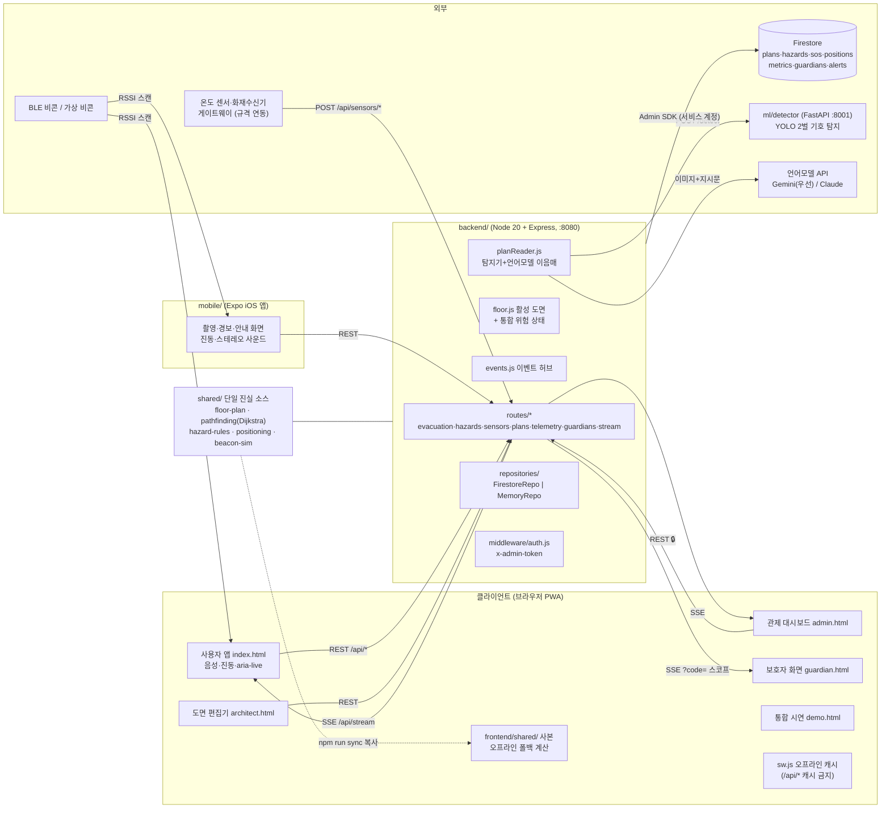
```mermaid
flowchart LR
  subgraph CLIENT["클라이언트 (브라우저 PWA)"]
    U["사용자 앱 index.html<br/>음성·진동·aria-live"]
    A["관제 대시보드 admin.html"]
    G["보호자 화면 guardian.html"]
    AR["도면 편집기 architect.html"]
    D["통합 시연 demo.html"]
    SW["sw.js 오프라인 캐시<br/>(/api/* 캐시 금지)"]
    FS["frontend/shared/ 사본<br/>오프라인 폴백 계산"]
  end

  subgraph MOBILE["mobile/ (Expo iOS 앱)"]
    M["촬영·경보·안내 화면<br/>진동·스테레오 사운드"]
  end

  subgraph BE["backend/ (Node 20 + Express, :8080)"]
    RT["routes/*<br/>evacuation·hazards·sensors·plans·telemetry·guardians·stream"]
    FL["floor.js 활성 도면<br/>+ 통합 위험 상태"]
    EV["events.js 이벤트 허브"]
    PR["planReader.js<br/>탐지기+언어모델 이음매"]
    REPO["repositories/<br/>FirestoreRepo | MemoryRepo"]
    AUTH["middleware/auth.js<br/>x-admin-token"]
  end

  SH["shared/ 단일 진실 소스<br/>floor-plan · pathfinding(Dijkstra)<br/>hazard-rules · positioning · beacon-sim"]

  subgraph EXT["외부"]
    F[("Firestore<br/>plans·hazards·sos·positions<br/>metrics·guardians·alerts")]
    ML["ml/detector (FastAPI :8001)<br/>YOLO 2벌 기호 탐지"]
    LLM["언어모델 API<br/>Gemini(우선) / Claude"]
    SEN["온도 센서·화재수신기<br/>게이트웨이 (규격 연동)"]
    BC["BLE 비콘 / 가상 비콘"]
  end

  U -- "REST /api/*" --> RT
  A -- "REST 🔒" --> RT
  AR -- "REST" --> RT
  M -- "REST" --> RT
  RT -- "SSE /api/stream" --> U
  RT -- "SSE" --> A
  RT -- "SSE ?code= 스코프" --> G
  BE -- "Admin SDK (서비스 계정)" --> F
  PR -- "POST /detect" --> ML
  PR -- "이미지+지시문" --> LLM
  SEN -- "POST /api/sensors/*" --> RT
  BC -- "RSSI 스캔" --> U
  BC -- "RSSI 스캔" --> M
  SH --- BE
  SH -. "npm run sync 복사" .-> FS
```

| 구성 요소 | 책임 | 하지 않는 것 |
|---|---|---|
| frontend (PWA) | 안내 UX, 상태머신, 측위 스캔, 오프라인 폴백 계산 | Firestore 직접 접근, 위험 판정 권위 |
| backend | 경로 계산 권위, 위험 검증·병합, 인증, 웹훅, SSE 브로드캐스트, AI 판독 오케스트레이션 | 이미지의 클라이언트 위임 판정 |
| shared | 지도 그래프·Dijkstra·위험 규칙·측위 로직의 단일 진실 소스 | I/O·화면 의존 |
| ml/detector | 기호 위치 탐지만 | 글자 읽기, 통로 연결 (못 한다) |
| 언어모델 | 이름·통로 연결 읽기만 | 좌표 결정 (눈대중 오차) |
| mobile | 촬영·경보·전달(진동·소리) | 경로·위험 계산 ("앱은 계산하지 않는다") |

> **경계 원칙 1** — 프론트엔드는 Firestore에 직접 접근하지 않는다. 모든 DB 접근은 백엔드가 서비스 계정으로 수행한다. 브라우저에 Firebase 자격증명이 노출되지 않고, 위험 상태 쓰기를 관제 인증으로만 통제할 수 있다 — 잘못된 위험 정보 주입은 곧바로 오안내 → 인명위험이기 때문이다.
>
> **경계 원칙 2** — `shared/`는 단일 진실 소스다. 백엔드가 권위 있는 계산을 하지만, 통신이 끊겼을 때 프론트가 캐시된 위험 상태로 직접 계산해 안내를 이어가야 하므로(`npm run sync`가 `frontend/shared/`로 복사) 양쪽이 같은 코드를 쓴다.
>
> **경계 원칙 3** — 판단은 서버 한 곳에 둔다. 어느 출구로 갈지·위험 제외·화재 판정은 서버, "지금 이쪽, 몇 걸음"의 전달(진동·소리)과 걸음 세기·방향 맞추기는 앱. 판단을 두 곳에 두면 관제 화면과 앱이 다른 말을 하게 되고, 대피 중에 그건 치명적이다.

## 4.2 서비스 전체 플로우

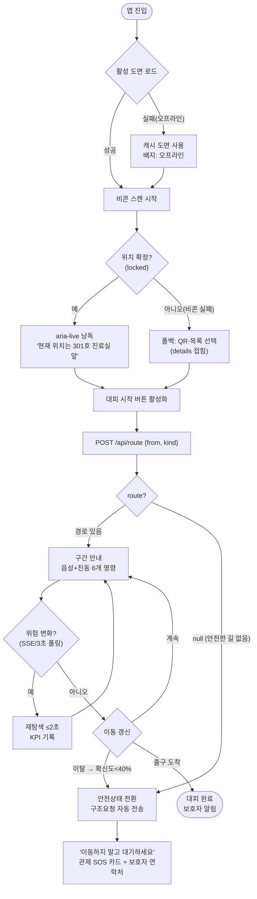
```mermaid
flowchart TB
  S(["앱 진입"]) --> P{"활성 도면 로드"}
  P -- "성공" --> B["비콘 스캔 시작"]
  P -- "실패(오프라인)" --> C["캐시 도면 사용<br/>배지: 오프라인"] --> B
  B --> L{"위치 확정?<br/>(locked)"}
  L -- "예" --> AN["aria-live 낭독<br/>'현재 위치는 301호 진료실 앞'"] --> ST["대피 시작 버튼 활성화"]
  L -- "아니오(비콘 실패)" --> FB["폴백: QR·목록 선택<br/>(details 접힘)"] --> ST
  ST --> R["POST /api/route {from, kind}"]
  R --> Q{"route?"}
  Q -- "경로 있음" --> GUIDE["구간 안내<br/>음성+진동 6개 명령"]
  Q -- "null (안전한 길 없음)" --> SAFE["안전상태 전환<br/>구조요청 자동 전송"]
  GUIDE --> H{"위험 변화?<br/>(SSE/3초 폴링)"}
  H -- "예" --> RE["재탐색 ≤2초<br/>KPI 기록"] --> GUIDE
  H -- "아니오" --> MV{"이동 갱신"}
  MV -- "이탈 → 확신도<40%" --> SAFE
  MV -- "출구 도착" --> DONE(["대피 완료<br/>보호자 알림"])
  MV -- "계속" --> GUIDE
  SAFE --> WAIT["'이동하지 말고 대기하세요'<br/>관제 SOS 카드 + 보호자 연락처"]
```

## 4.3 대피 상태머신 (frontend/js/app.js)

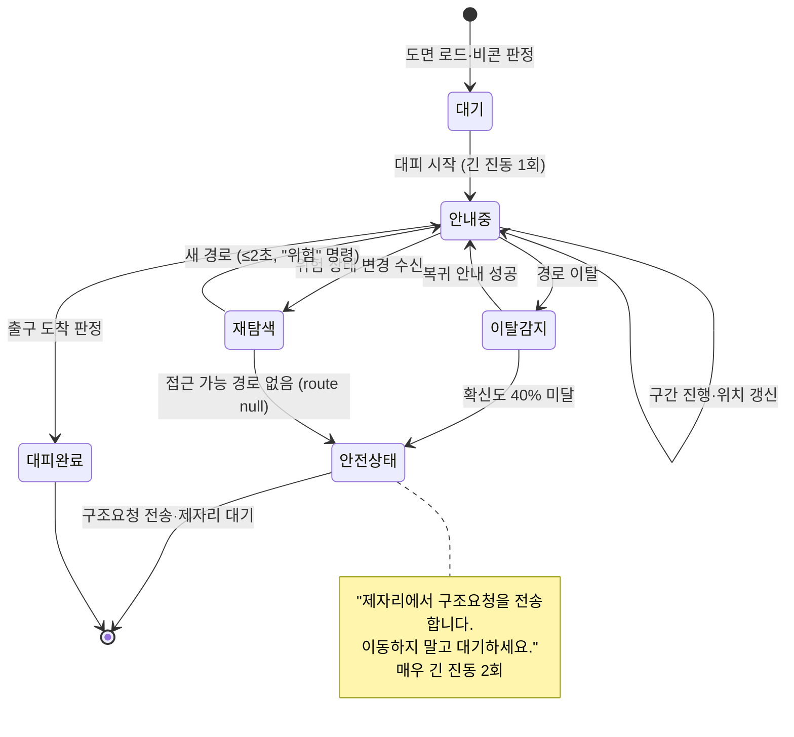
```mermaid
stateDiagram-v2
  [*] --> 대기: 도면 로드·비콘 판정
  대기 --> 안내중: 대피 시작 (긴 진동 1회)
  안내중 --> 안내중: 구간 진행·위치 갱신
  안내중 --> 재탐색: 위험 상태 변경 수신
  재탐색 --> 안내중: 새 경로 (≤2초, "위험" 명령)
  안내중 --> 이탈감지: 경로 이탈
  이탈감지 --> 안내중: 복귀 안내 성공
  이탈감지 --> 안전상태: 확신도 40% 미달
  재탐색 --> 안전상태: 접근 가능 경로 없음 (route null)
  안전상태 --> [*]: 구조요청 전송·제자리 대기
  안내중 --> 대피완료: 출구 도착 판정
  대피완료 --> [*]
  note right of 안전상태
    "제자리에서 구조요청을 전송합니다.
    이동하지 말고 대기하세요."
    매우 긴 진동 2회
  end note
```

모바일(`App.js`의 `phase`)은 평소(촬영)와 화재(경보→안내)를 같은 화면 하나의 전환으로 관리한다 — Ⅴ.2 참조.

## 4.4 핵심 기능 설계

### 4.4.1 경로탐색 (shared/pathfinding.js)

- Anyplace의 `Dijkstra.scala`를 JS로 포팅. `routeToNearestExit(floorPlan, fromId, hazards)`가 모든 `exit` 노드 중 접근 가능한 최단 목적지를 고른다.
- 차단 엣지(과열 60°C+, 화재, 연기, 관제 차단)는 그래프에서 제외, 온도 상승(45°C+) 엣지는 가중치 ×4.
- 화재 모드에서 `elevator: true` 통로 자동 제외.
- 반환 경로는 구간 배열로, 각 구간에 거리(→걸음 수), 회전 방향, 따라갈 벽이 실린다. 경로가 없으면 `route: null` — "안전한 길이 없다"는 뜻이고 이는 실패가 아니라 **안전상태 전환 신호**다.

### 4.4.2 BLE 측위 파이프라인 (shared/positioning.js)

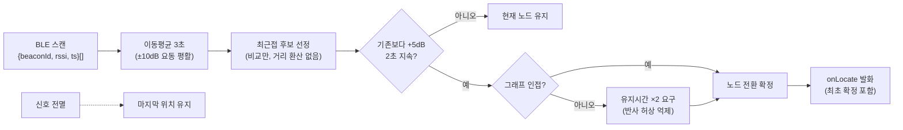
```mermaid
flowchart LR
  SCAN["BLE 스캔<br/>{beaconId, rssi, ts}[]"] --> SM["이동평균 3초<br/>(±10dB 요동 평활)"]
  SM --> CMP["최근접 후보 선정<br/>(비교만, 거리 환산 없음)"]
  CMP --> HYS{"기존보다 +5dB<br/>2초 지속?"}
  HYS -- "아니오" --> KEEP["현재 노드 유지"]
  HYS -- "예" --> ADJ{"그래프 인접?"}
  ADJ -- "예" --> SWITCH["노드 전환 확정"]
  ADJ -- "아니오" --> HOLD["유지시간 ×2 요구<br/>(반사 허상 억제)"]
  HOLD --> SWITCH
  SWITCH --> OUT["onLocate 발화<br/>(최초 확정 포함)"]
  DEAD["신호 전멸"] -.-> LAST["마지막 위치 유지"]
```

| 처리 | 값 | 이유 |
|---|---|---|
| 이동평균 | 3초 | 원시 RSSI는 정지 상태에서도 ±10dB 튄다 |
| 전환 문턱 | 5dB | 이만큼 더 세지 않으면 도전 자격 없음 |
| 유지 시간 | 2초 | 없으면 노드 경계에서 위치가 초 단위로 깜빡인다 |
| 비인접 전환 | 유지 시간 ×2 | 통로로 안 이어진 곳으로의 "이동"은 대개 반사가 만든 허상 |
| 신호 전멸 | 마지막 위치 유지 (모바일 확정 불가 시 `null`) | 위치를 비우면 안내가 통째로 끊긴다 / 아무 지점이나 돌려주면 엉뚱한 경로가 나온다 |

구현: `BeaconLocator`(스캔 배열→nodeId), `BeaconSense`(주기 스캔→판정→앱 통지), `beacon-sim.js`(로그-거리 모델 RSSI + ±6dB 노이즈 + 15% 패킷 유실). 측위 계층은 `{beaconId, rssi, ts}`만 받으므로 신호 출처를 모른다 — 기기 없이 로직 전체를 검증할 수 있고, 실기기 전환은 신호 생성 한 줄(웹 `beacon.js` / 모바일 `beaconLocator.js scanOnce()`)뿐이다.

### 4.4.3 PDR 보조 (odometry.js)와 확신도

- 가속도계 걸음 감지 + 방위 추적으로 비콘 사이 구간의 추정 위치를 잇는다. 비콘이 잡히면 그 노드로 확정(누적오차 리셋).
- 걸음·방위 불일치가 쌓이면 확신도가 하락 → 40% 미달 시 안내 중단 + 구조요청. 모바일은 나침반 안정도(`BearingSensor.stability`)가 `STABILITY_FLOOR` 미달이면 방향 안내 자체를 멈추고 경고한다.

### 4.4.4 위험 병합 규칙 (shared/hazard-rules.js)

| 온도 | 판정 | 경로탐색 처리 |
|---|---|---|
| 60°C 이상 | 🚫 과열 — 통행 불가 | 그래프에서 제외 |
| 45°C 이상 | ⚠️ 온도 상승 | 통행 가능하되 가중치 ×4로 강하게 회피 |
| 그 미만 | 정상 | 영향 없음 |
| 60초 이상 갱신 없음 | 판독 끊김 | **신뢰하지 않음** — 오래된 값으로 안내하지 않는다. 지도에 흐린 `⚠` |

관제 지정과 센서 판정이 겹치면 더 심각한 쪽 채택. 지점 센서 과열은 연결된 모든 통로 차단.

### 4.4.5 방위 체계 (northOffset)

| 구분 | 정의 | 쓰임 |
|---|---|---|
| 도면 방위 | 도면 위쪽이 0. 도면 안에서만 참 | 도면 위 그리기·좌우 회전 계산 |
| 실제 방위 | 자북이 0. 나침반과 견줄 수 있다 | 진동 방향 안내("맞다/틀리다") |

- `northOffset`이 없으면 **진동 방향 안내를 끈다** — 추측해서 가리키면 시각장애인이 벽으로 걸어간다.
- **좌우 회전 안내는 보정 없이도 맞다** — 이전 구간과의 *차이*라 도면이 어느 쪽으로 그려졌든 상쇄된다. 그래서 보정 없는 도면에서도 안내가 아예 죽지는 않는다.
- 값은 도면 앞에 선 사람만 알 수 있으므로 **앱이 나침반으로 직접 잰다** (SubmitScreen).

## 4.5 시퀀스 다이어그램

### 4.5.1 대피 시작 (UC-01→UC-02)

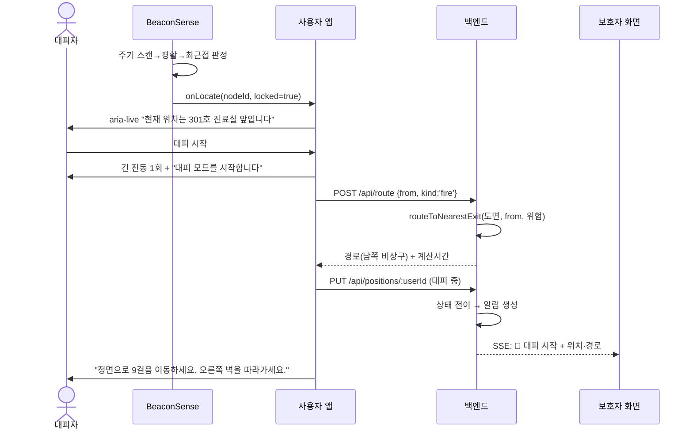
```mermaid
sequenceDiagram
  actor V as 대피자
  participant B as BeaconSense
  participant APP as 사용자 앱
  participant BE as 백엔드
  participant GD as 보호자 화면
  B->>B: 주기 스캔→평활→최근접 판정
  B->>APP: onLocate(nodeId, locked=true)
  APP->>V: aria-live "현재 위치는 301호 진료실 앞입니다"
  V->>APP: 대피 시작
  APP->>V: 긴 진동 1회 + "대피 모드를 시작합니다"
  APP->>BE: POST /api/route {from, kind:'fire'}
  BE->>BE: routeToNearestExit(도면, from, 위험)
  BE-->>APP: 경로(남쪽 비상구) + 계산시간
  APP->>BE: PUT /api/positions/:userId (대피 중)
  BE->>BE: 상태 전이 → 알림 생성
  BE-->>GD: SSE: 🚨 대피 시작 + 위치·경로
  APP->>V: "정면으로 9걸음 이동하세요. 오른쪽 벽을 따라가세요."
```

### 4.5.2 관제 위험 지정 → 재탐색 (UC-08→UC-04)

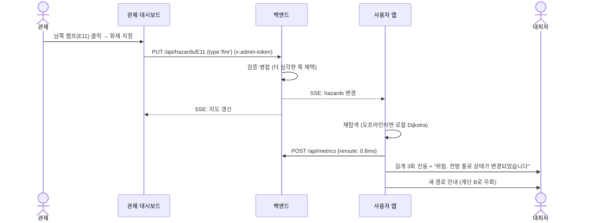
```mermaid
sequenceDiagram
  actor OP as 관제
  participant AD as 관제 대시보드
  participant BE as 백엔드
  participant APP as 사용자 앱
  actor V as 대피자
  OP->>AD: 남쪽 램프(E11) 클릭 → 화재 지정
  AD->>BE: PUT /api/hazards/E11 {type:'fire'} (x-admin-token)
  BE->>BE: 검증·병합 (더 심각한 쪽 채택)
  BE-->>APP: SSE: hazards 변경
  BE-->>AD: SSE: 지도 갱신
  APP->>APP: 재탐색 (오프라인이면 로컬 Dijkstra)
  APP->>BE: POST /api/metrics {reroute: 0.8ms}
  APP->>V: 길게 3회 진동 + "위험. 전방 통로 상태가 변경되었습니다"
  APP->>V: 새 경로 안내 (계단 B로 우회)
```

### 4.5.3 온도 센서 → 자동 회피 (UC-09)

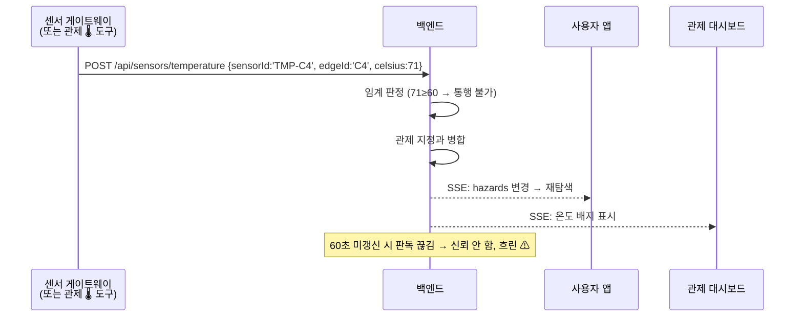
```mermaid
sequenceDiagram
  participant S as 센서 게이트웨이<br/>(또는 관제 🌡️ 도구)
  participant BE as 백엔드
  participant APP as 사용자 앱
  participant AD as 관제 대시보드
  S->>BE: POST /api/sensors/temperature {sensorId:'TMP-C4', edgeId:'C4', celsius:71}
  BE->>BE: 임계 판정 (71≥60 → 통행 불가)
  BE->>BE: 관제 지정과 병합
  BE-->>APP: SSE: hazards 변경 → 재탐색
  BE-->>AD: SSE: 온도 배지 표시
  Note over BE: 60초 미갱신 시 판독 끊김 → 신뢰 안 함, 흐린 ⚠
```

### 4.5.4 접근 불가 → 안전상태·SOS (UC-05)

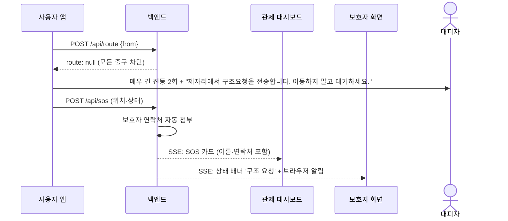
```mermaid
sequenceDiagram
  participant APP as 사용자 앱
  participant BE as 백엔드
  participant AD as 관제 대시보드
  participant GD as 보호자 화면
  actor V as 대피자
  APP->>BE: POST /api/route {from}
  BE-->>APP: route: null (모든 출구 차단)
  APP->>V: 매우 긴 진동 2회 + "제자리에서 구조요청을 전송합니다. 이동하지 말고 대기하세요."
  APP->>BE: POST /api/sos (위치·상태)
  BE->>BE: 보호자 연락처 자동 첨부
  BE-->>AD: SSE: SOS 카드 (이름·연락처 포함)
  BE-->>GD: SSE: 상태 배너 '구조 요청' + 브라우저 알림
```

### 4.5.5 보호자 등록·관찰 (UC-11→UC-12)

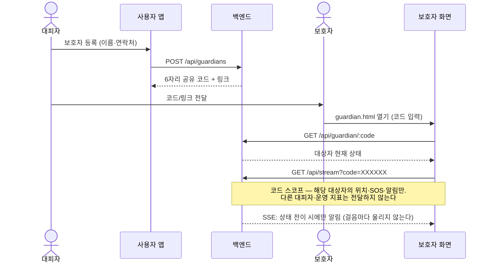
```mermaid
sequenceDiagram
  actor V as 대피자
  participant APP as 사용자 앱
  participant BE as 백엔드
  actor G as 보호자
  participant GD as 보호자 화면
  V->>APP: 보호자 등록 (이름·연락처)
  APP->>BE: POST /api/guardians
  BE-->>APP: 6자리 공유 코드 + 링크
  V->>G: 코드/링크 전달
  G->>GD: guardian.html 열기 (코드 입력)
  GD->>BE: GET /api/guardian/:code
  BE-->>GD: 대상자 현재 상태
  GD->>BE: GET /api/stream?code=XXXXXX
  Note over BE,GD: 코드 스코프 — 해당 대상자의 위치·SOS·알림만.<br/>다른 대피자·운영 지표는 전달하지 않는다
  BE-->>GD: SSE: 상태 전이 시에만 알림 (걸음마다 울리지 않는다)
```

### 4.5.6 도면 촬영 → 초안 → 확인 → 활성화 (UC-13→UC-15)

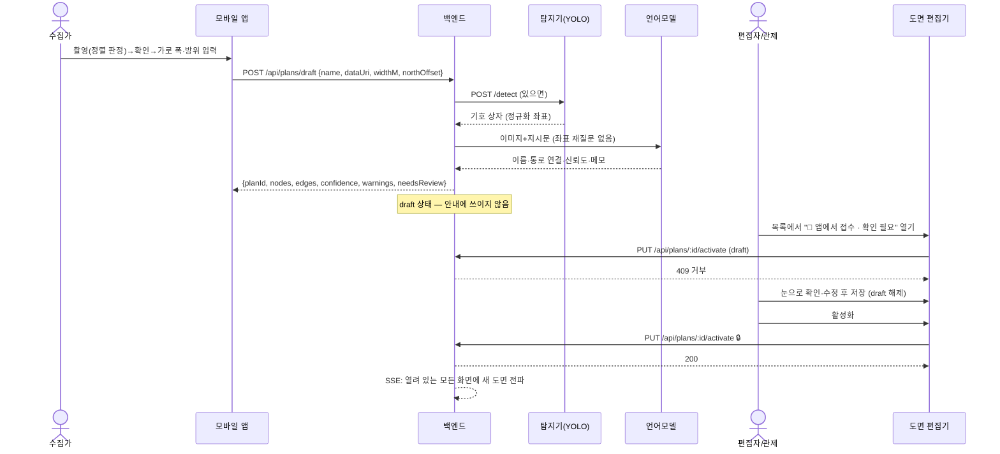
```mermaid
sequenceDiagram
  actor P as 수집가
  participant M as 모바일 앱
  participant BE as 백엔드
  participant ML as 탐지기(YOLO)
  participant LM as 언어모델
  actor E as 편집자/관제
  participant AR as 도면 편집기
  P->>M: 촬영(정렬 판정)→확인→가로 폭·방위 입력
  M->>BE: POST /api/plans/draft {name, dataUri, widthM, northOffset}
  BE->>ML: POST /detect (있으면)
  ML-->>BE: 기호 상자 (정규화 좌표)
  BE->>LM: 이미지+지시문 (좌표 재질문 없음)
  LM-->>BE: 이름·통로 연결·신뢰도·메모
  BE-->>M: {planId, nodes, edges, confidence, warnings, needsReview}
  Note over BE: draft 상태 — 안내에 쓰이지 않음
  E->>AR: 목록에서 "📱 앱에서 접수 · 확인 필요" 열기
  AR->>BE: PUT /api/plans/:id/activate (draft) 
  BE-->>AR: 409 거부
  E->>AR: 눈으로 확인·수정 후 저장 (draft 해제)
  E->>AR: 활성화
  AR->>BE: PUT /api/plans/:id/activate 🔒
  BE-->>AR: 200
  BE-->>BE: SSE: 열려 있는 모든 화면에 새 도면 전파
```

## 4.6 에러 처리 및 예외상황 설계

| 상황 | 감지 | 처리 | 사용자 전달 |
|---|---|---|---|
| 백엔드 단절 | API 실패/프록시 503 | 오프라인 폴백 — 캐시 도면·위험으로 로컬 계산 | 배지 "오프라인", 안내 지속 |
| 접근 가능 경로 없음 | `route: null` | 안전상태 전환 + SOS 자동 전송 | "이동하지 말고 대기하세요" |
| 확신도 미달 | 이탈 누적 <40% | 임의 안내 중단 + SOS | 구조요청 명령 (매우 긴 진동 2회) |
| 나침반 불안정 (모바일) | `stability` < `STABILITY_FLOOR` | 방향 안내 중단 | 경고 발화 — 틀린 방향을 자신 있게 알려주지 않는다 |
| 비콘 신호 전멸 | 스캔 무응답 | 마지막 위치 유지(웹) / `null` 반환(모바일 확정 불가) | 폴백 선택 UI 개방 |
| 센서 판독 끊김 | 60초 미갱신 | 해당 판독 무시 | 지도에 흐린 `⚠` |
| 사용 중 도면 삭제 시도 | `DELETE /api/plans/:id` | 409 거부 | 편집기 안내 |
| draft 활성화 시도 | `activate` on draft | 409 거부 | "확인 필요" 안내 |
| 도면 검증 실패 | 출구 없음/유령 통로/id 중복 | 저장 거부 | 사유 명시 |
| 비콘 id 중복 | 두 지점에 같은 id | 저장 거부 | 측위 갈팡질팡 방지 |
| 탐지기 꺼짐 | `/health` 실패 | `null` 반환 (예외 아님) — 언어모델 단독 또는 수동 | 편집기에 조합 표시 |
| 게이트웨이 이미지 유실 | 시야 점검 실패 | 판독 거부 503 | "그림이 전달되지 않았습니다" |
| 서버가 도면을 못 줌 (모바일) | `/api/map` 실패 | `demoPlan.js` 폴백 — 진짜인 척하지 않는다 | 폴백 사실 음성·화면 고지 |
| 포트 점유 | dev-server 기동 시 | 이전 실행 안내 / 다음 포트 이동 | 콘솔 안내 |

## 4.7 성능 설계

| 항목 | 설계 | 근거·실측 |
|---|---|---|
| 재탐색 | 노드 수십 규모 Dijkstra 즉시 계산 | 실측 0.8ms (KPI 로그), 목표 2초 대비 여유 |
| 위험 전파 | SSE 즉시 push (+모바일 3초 폴링 겸용) | 폴링 대비 지연 최소 |
| 도면 이미지 | 업로드 시 브라우저 자동 축소·압축 900KB 이하 | 전송·저장 부담 절감 |
| 탐지 추론 | `DETECT_IMGSZ=768`, GPU 자동 사용 | CPU 5~15초/장 (편집기 안내 "20초~1분") |
| 판독 캐시 | 게이트웨이 시야 점검 결과 프로세스 생존 동안 재사용 | 중복 점검 제거 |
| 개발 반영 | `/shared/*`는 원본 직접 서빙 — 수정 후 새로고침만 | 사본 동기화는 배포 시 `npm run sync` |
---

# Ⅴ. 화면 설계

본 장의 모든 화면은 **실제 구동 중인 시스템을 캡처**한 것이다 (2026-08-18, 인메모리 데모 저장소 모드, 활성 도면: 모바일 앱으로 촬영·AI 판독한 실데이터 **AI공학관 3층** — 지점 15·통로 14). 비콘 미설치 도면이므로 측위는 `(가상 비콘 시뮬레이션)`으로 동작하며, 화면에 그 사실이 표기된다.

## 5.1 화면 구성 개요

| 플랫폼 | 화면 | 파일 | 대상 사용자 | 캡처 |
|---|---|---|---|---|
| 웹 | 사용자 앱 — 시작 | `frontend/index.html` | 시각장애인·저시력·동행자 | 5.3.1 |
| 웹 | 사용자 앱 — 보호자 등록 | 〃 | 대피자 | 5.3.2 |
| 웹 | 사용자 앱 — 안내 | 〃 | 대피자 | 5.3.3 |
| 웹 | 사용자 앱 — 재탐색/안전상태 | 〃 | 대피자 | 5.3.4~5.3.5 |
| 웹 | 관제 대시보드 | `frontend/admin.html` | 관제 담당자 | 5.3.6 |
| 웹 | 보호자 화면 | `frontend/guardian.html` | 보호자 | 5.3.7 |
| 웹 | 도면 편집기 | `frontend/architect.html` | 건축·도면 담당자 | 5.3.8 |
| 웹 | 통합 시연 | `frontend/demo.html` | 발표·심사 | 5.3.9 |
| 모바일 | Capture·Review·Submit·Alarm·Guide·Start | `mobile/src/screens/` | 수집가·대피자 | 5.4 (Expo Go 실기기 캡처 예정) |

## 5.2 화면 전환 흐름

### 5.2.1 모바일 — 메뉴도 탭도 없다. 화면 하나가 상황에 따라 바뀐다

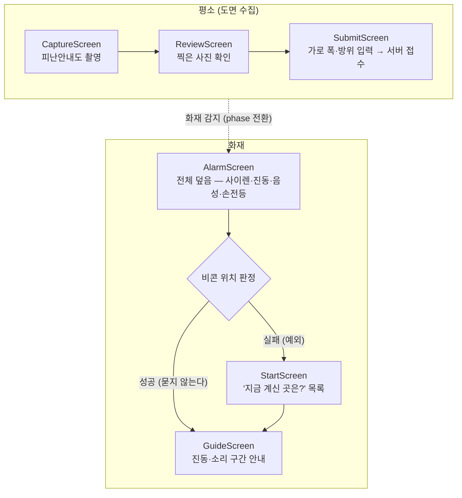
```mermaid
flowchart TB
  subgraph NORMAL["평소 (도면 수집)"]
    CAP["CaptureScreen<br/>피난안내도 촬영"] --> REV["ReviewScreen<br/>찍은 사진 확인"]
    REV --> SUB["SubmitScreen<br/>가로 폭·방위 입력 → 서버 접수"]
  end
  subgraph FIRE["화재"]
    AL["AlarmScreen<br/>전체 덮음 — 사이렌·진동·음성·손전등"]
    AL --> LOC{"비콘 위치 판정"}
    LOC -- "성공 (묻지 않는다)" --> GU["GuideScreen<br/>진동·소리 구간 안내"]
    LOC -- "실패 (예외)" --> STT["StartScreen<br/>'지금 계신 곳은?' 목록"]
    STT --> GU
  end
  NORMAL -. "화재 감지 (phase 전환)" .-> AL
```

전환은 `App.js`의 `phase`가 관리한다. **대피 안내는 사용자가 여는 게 아니라 스스로 열린다** — 시각장애인이 화재 중에 메뉴를 찾아 들어갈 수 없기 때문이다.

### 5.2.2 웹 사용자 앱 — 상태에 따른 화면 전환

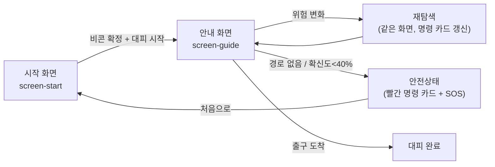
```mermaid
flowchart LR
  ST["시작 화면<br/>screen-start"] -- "비콘 확정 + 대피 시작" --> GU["안내 화면<br/>screen-guide"]
  GU -- "위험 변화" --> GU2["재탐색<br/>(같은 화면, 명령 카드 갱신)"] --> GU
  GU -- "경로 없음 / 확신도<40%" --> SF["안전상태<br/>(빨간 명령 카드 + SOS)"]
  GU -- "출구 도착" --> DN["대피 완료"]
  SF -- "처음으로" --> ST
```

## 5.3 웹 화면 상세 설계

### 5.3.1 사용자 앱 — 시작 화면 (위치 자동 판정)

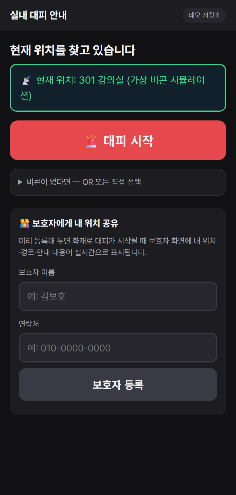

- 앱을 열면 **아무 조작 없이** 비콘 측위가 시작되고, 판정이 확정되는 순간 초록 테두리 카드에 **"📡 현재 위치: 301 강의실 (가상 비콘 시뮬레이션)"** 이 표시된다. 이 영역은 `aria-live="polite"`라 스크린리더가 즉시 읽어주며, 동시에 음성으로 "현재 위치는 301 강의실 입니다. 대피 시작 버튼을 누르세요."가 발화된다.
- 실제 비콘이 아닌 시뮬레이션으로 판정한 경우 **(가상 비콘 시뮬레이션)** 문구를 붙여 실측과 구분한다.
- **🚨 대피 시작** 버튼은 위치 확정 전에는 비활성이며, 확정되는 순간 활성화된다. 누르면 긴 진동 1회와 함께 안내 화면으로 전환된다.
- **"비콘이 없다면 — QR 또는 직접 선택"** 은 `<details>`로 접혀 있는 **폴백 경로**다. 펼치면 📷 QR 코드로 위치 확인 버튼과 지점 목록(picker)이 나온다. 정상 경로(비콘)에서는 이 목록을 훑을 필요가 없다 — 스크린리더로 목록을 넘기는 수십 번의 탭을 화재 상황에서 쓰게 하지 않기 위한 설계다.
- 우상단 모드 배지는 저장소·연결 상태(데모 저장소 / 온라인 / **오프라인**)를 표시한다. 백엔드가 끊기면 "오프라인"으로 바뀌고 캐시된 지도로 안내가 계속된다.
- 하단에 **👨‍👩‍👧 보호자에게 내 위치 공유** 섹션이 있다 (5.3.2).

| UI 구역 | UI 요소 | 상세 명세 | 상태별 변화 |
|---|---|---|---|
| 상단바 | 제목·모드 배지 | "실내 대피 안내" + 저장소/연결 상태 (`aria-live=polite`) | 온라인↔오프라인 전환 시 갱신 |
| 판정 카드 | `#beacon-status` | 확인 중 → 확정 시 초록 테두리 + 지점명 + 가상 표기 | 확정 전 잠정값은 **표시·발화하지 않음** |
| 중앙 | `#btn-start` 대피 시작 | 빨간 대형 버튼. 탭 시 긴 진동 1회 + "대피 모드를 시작합니다" | 위치 확정 전 `disabled` |
| 폴백 | QR·지점 목록 | `<details>` 접힘. 지점 선택 시 그 자리 기준으로 비콘 재계산 | 비콘 실패 시에만 사용 |
| 하단 | 보호자 등록 | 이름·연락처 입력 + 등록 버튼 | 등록 후 결과 패널 표시 |

### 5.3.2 사용자 앱 — 보호자 등록 (대피 전 사전 등록)

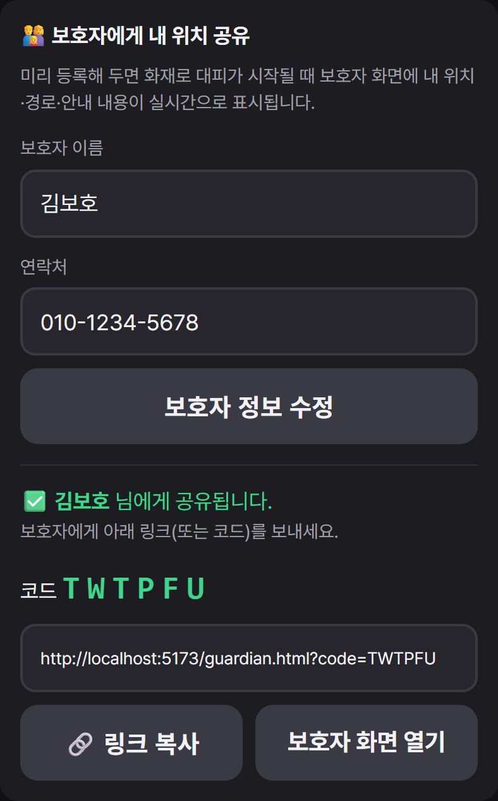

- 보호자 이름·연락처를 넣고 **보호자 등록**을 누르면 `POST /api/guardians`로 **6자리 공유 코드**(예: `TWTPFU`)와 링크가 발급된다.
- 결과 패널은 "✅ 김보호 님에게 공유됩니다."와 코드·읽기전용 링크 입력창·**🔗 링크 복사**·**보호자 화면 열기** 버튼으로 구성된다.
- 미리 등록해 두면 화재로 대피가 시작되는 순간부터 보호자 화면(5.3.7)에 위치·경로·안내 내용이 실시간 표시된다.

| UI 구역 | UI 요소 | 상세 명세 | 상태별 변화 |
|---|---|---|---|
| 입력부 | `#guardian-name` / `#guardian-contact` | 이름(text)·연락처(tel) | — |
| 결과부 | `#guardian-result` | 코드 강조 표기 + 공유 링크 + 복사/열기 버튼 (`aria-live`) | 등록 성공 시에만 표시 |
| 데이터 | 코드 스코프 | 이 코드로 여는 스트림은 해당 대상자 정보만 내려간다 (Ⅸ.4) | — |

### 5.3.3 사용자 앱 — 안내 화면 (대피 중) [핵심 화면]

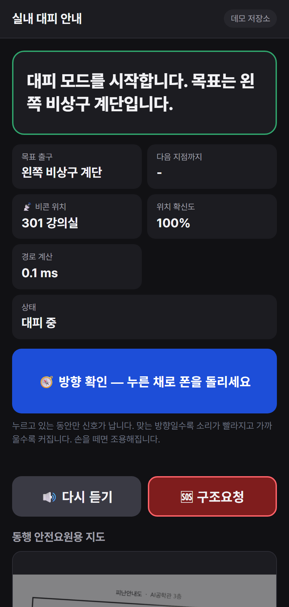

- 최상단 **명령 카드**(`aria-live="assertive"`)가 이 화면의 핵심이다. 캡처 시점 문구: **"대피 모드를 시작합니다. 목표는 왼쪽 비상구 계단입니다."** 이후 구간마다 "정면으로 7걸음 이동하세요. 오른쪽 벽을 따라가세요."류의 6개 명령(5.5)이 갱신되고, 갱신될 때마다 스크린리더가 즉시 읽는다.
- **대피 상태 KPI 6종**: 목표 출구(왼쪽 비상구 계단) · 다음 지점까지(걸음 수) · 📡 비콘 위치(301 강의실) · 위치 확신도(100%) · 경로 계산(0.1 ms) · 상태(대피 중). 경로 계산 ms는 검증 가설 ③(재탐색 2초 이내)의 실측값이다.
- **🧭 방향 확인 — 누른 채로 폰을 돌리세요** (파란 대형 버튼): 누르고 있는 동안만 신호가 나며, 맞는 방향일수록 소리가 빨라지고 가까울수록 커진다. 손을 떼면 조용해진다 — 연속 배경음을 금지하는 접근성 규칙(5.6)에 따른 푸시-투-스캔 설계다.
- **🔊 다시 듣기**로 마지막 명령을 재발화하고, **🆘 구조요청**으로 수동 SOS를 보낼 수 있다.
- 하단 **동행 안전요원용 지도**(5.3.3.1)와 **워크스루 데모 조작** 패널(👣 한 걸음 / 자동 이동 / ↯ 경로 이탈 재현 — 센서 없는 환경용, 휴대폰에서는 devicemotion·나침반으로 자동 추적)이 있다.

| UI 구역 | UI 요소 | 상세 명세 | 상태별 변화 |
|---|---|---|---|
| 명령 카드 | `#command-text` | `aria-live=assertive` + `aria-atomic` — 명령 전문을 통째로 낭독 | 초록 테두리(정상)↔빨강(안전상태) |
| KPI | 6종 지표 | 목표 출구·걸음·비콘 위치·확신도·계산 ms·상태 | 매 갱신 실시간 |
| 방향 확인 | `#btn-scan` | 누르는 동안만 소리(빠르기=방향 정확도, 크기=근접도) | 뗌과 동시에 정지 |
| 동작 | 다시 듣기 / 구조요청 | TTS 재발화 / 수동 SOS 전송 | — |
| 데모 패널 | 한 걸음·자동 이동·이탈 재현 | `<details>` 접힘 — 시연 전용 조작 | — |

#### 5.3.3.1 동행 안전요원용 지도 (minimap.js)

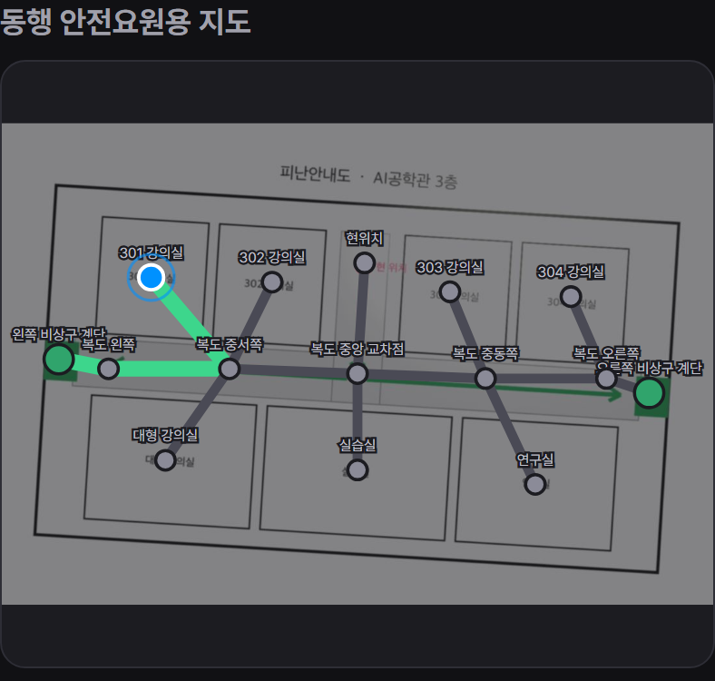

- 실제 피난안내도 사진을 배경으로 지점·통로 그래프를 겹쳐 그린 SVG 지도다. 현재 위치(파란 원), 안내 경로(초록), 출구(초록 원)가 표시되고, 위험 통로는 빨간 점선, 온도 판독값은 배지로 얹힌다.
- 이 지도는 `aria-hidden` — **눈이 보이는 동행자(가족·소방관)와 저시력자를 위한 이중화 채널**이다. 시각장애인에게는 같은 정보가 음성·진동으로 전달된다. 하나를 지우지 않는다(5.6).

### 5.3.4 사용자 앱 — 위험 변화 재탐색

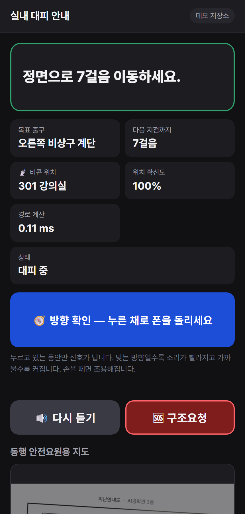

- 관제가 경로 중간 통로(복도 왼쪽↔복도 중서쪽)에 화재를 지정하자, SSE로 위험 변경을 받은 앱이 **즉시 재탐색**했다. 캡처는 그 직후 상태다: 명령 카드 "정면으로 7걸음 이동하세요.", **목표 출구가 왼쪽 → 오른쪽 비상구 계단으로 교체**, 경로 계산 **0.11 ms** (2초 목표 대비 여유), 상태는 "대피 중" 유지.
- 재탐색 순간에는 길게 3회 진동 + "위험. 전방 통로 상태가 변경되었습니다." 명령이 먼저 발화된 뒤 새 경로의 첫 구간 안내가 이어진다.
- 지도에는 차단된 통로가 빨간 점선으로, 새 경로가 초록으로 갱신된다.

### 5.3.5 사용자 앱 — 안전상태·구조요청 (접근 가능 경로 없음)

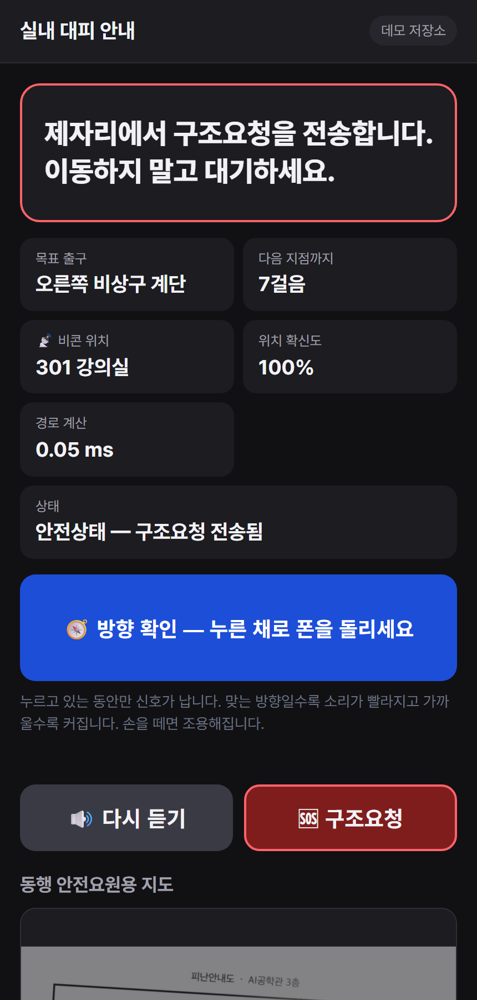

- 남은 통로까지 차단되어 **어느 출구로도 갈 수 없게 되자**(`route: null`) 앱이 스스로 안내를 멈추고 안전상태로 전환했다. 명령 카드가 **빨간 테두리**로 바뀌며 "제자리에서 구조요청을 전송합니다. **이동하지 말고 대기하세요.**"를 매우 긴 진동 2회와 함께 발화한다.
- 상태 KPI가 **"안전상태 — 구조요청 전송됨"** 으로 바뀌고, SOS가 자동 전송된다(보호자 연락처 자동 첨부 → 관제 SOS 카드·보호자 화면에 동시 반영).
- 확신도가 기준(40%) 미만으로 떨어졌을 때도 같은 상태로 진입한다 — **틀린 방향을 자신 있게 알려주는 것보다 멈추는 쪽이 안전하다**는 원칙의 화면 표현이다.

### 5.3.6 관제 대시보드

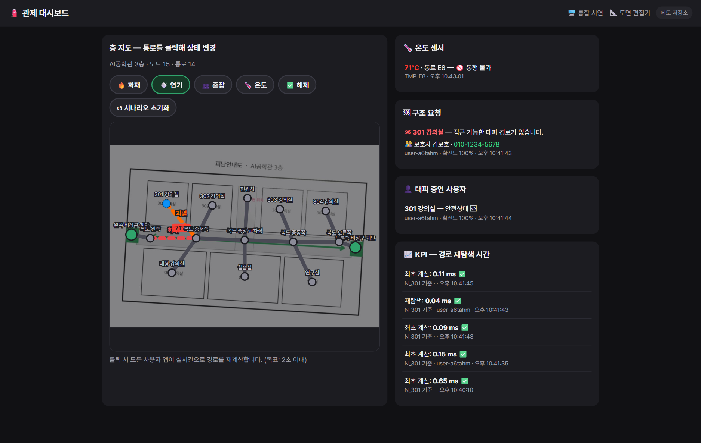

- **층 지도** — 실제 도면 사진 위에 그래프를 겹쳐 그리고, **통로를 클릭해 상태를 바꾼다.** 상단 도구(🔥 화재 / 💨 연기 / 👥 혼잡 / 🌡️ 온도 / ✅ 해제)로 클릭 모드를 고르며, 클릭 시 모든 사용자 앱이 실시간으로 경로를 재계산한다(목표 2초 이내). 캡처에는 화재 지정 통로(빨간 점선)와 71° 과열 배지가 보인다.
- **🌡️ 온도 센서 패널** — 판독값 목록: "71°C · 통로 E8 — 🚫 통행 불가 / TMP-E8 · 시각". 온도 도구는 실제 센서 게이트웨이와 **같은 API**(`POST /api/sensors/temperature`)를 호출하므로 실증에서 배선만 바꾸면 된다. 60초 이상 갱신 없는 센서는 흐리게 `⚠` 표시된다.
- **🆘 구조 요청 패널** — "301 강의실 — 접근 가능한 대피 경로가 없습니다."와 함께 **보호자 이름·연락처(👨‍👩‍👧 김보호 · 010-1234-5678)** 가 표시되어 구조대가 바로 연락할 수 있다.
- **👤 대피 중인 사용자** — 사용자별 위치·상태(안전상태 등)·확신도·시각.
- **📈 KPI — 경로 재탐색 시간** — 최초 계산·재탐색 ms 기록 목록 (캡처: 재탐색 0.04ms ✅). 검증 가설 ③의 근거 패널이다.
- **↺ 시나리오 초기화** / **온도 판독값 전체 삭제** 버튼으로 시연 상태를 한 번에 되돌린다.

| UI 구역 | UI 요소 | 상세 명세 | 상태별 변화 |
|---|---|---|---|
| 좌측 | 층 지도 + 도구 5종 | 통로/지점 클릭 주입 (`PUT /api/hazards/:edgeId` 등 🔒) | 지정·해제 즉시 전 화면 SSE 전파 |
| 우측 1 | 온도 센서 목록 | 임계 판정(60/45°C)·노후(60초) 표기 | 판독 끊김 시 흐린 ⚠ |
| 우측 2 | SOS 카드 | 위치·사유 + 보호자 연락처 자동 첨부 | 발생 즉시 표시 |
| 우측 3 | 대피 중 사용자 | positions 실시간 | 상태 전이 반영 |
| 우측 4 | 재탐색 KPI | ms 이력 (`/api/metrics`) | 재탐색마다 추가 |

### 5.3.7 보호자 화면

#### ① 코드 입력

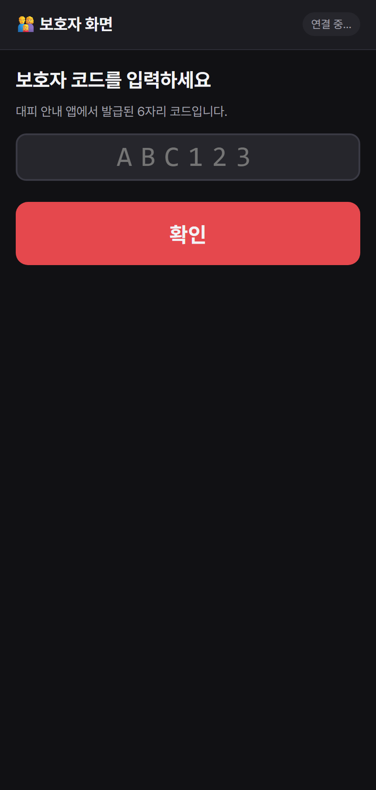

- 링크 없이 접속하면 **"보호자 코드를 입력하세요"** 화면이 뜬다. 6자리 코드 입력(자동 대문자, Enter 지원) 후 확인을 누르면 `?code=` 쿼리로 이동한다. 잘못된 코드는 `role="alert"` 오류 문구로 알린다.

#### ② 실시간 관찰 (대피 중)

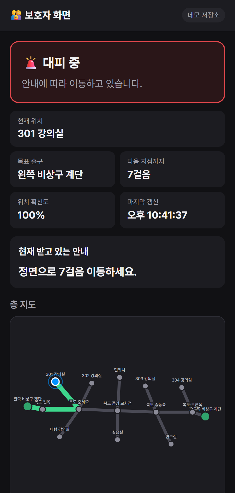

- 상단 **🚨 상태 배너**: "대피 중 — 안내에 따라 이동하고 있습니다." 상태는 대기 중 / 대피 중 / 구조 요청 / 대피 완료 4단계로 바뀌며, **바뀌는 순간에만** 브라우저 알림·진동이 울린다 (걸음마다 울리면 보호자가 알림을 꺼버린다).
- 현재 위치(301 강의실) · 목표 출구(왼쪽 비상구 계단) · 다음 지점까지(7걸음) · 위치 확신도(100%) · 마지막 갱신 시각이 실시간 갱신된다.
- **"현재 받고 있는 안내"** 에는 대상자가 **지금 듣고 있는 음성 안내 그대로**("정면으로 7걸음 이동하세요.")가 표시된다.
- 층 지도에 대상자 위치·안내 경로·위험 통로가 그려지고, 하단에 상황 기록 로그·🔔 알림 허용 버튼이 있다.

#### ③ 구조 요청 수신

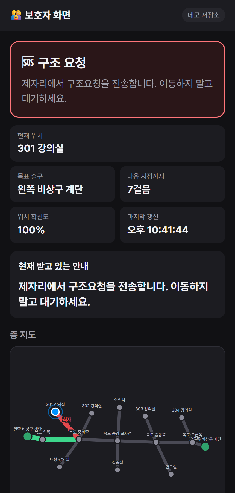

- 대상자가 안전상태로 전환되면 배너가 **🆘 구조 요청**으로 바뀌고 "제자리에서 구조요청을 전송합니다. 이동하지 말고 대기하세요."가 표시된다. 지도에는 차단된 통로(화재 배지)와 대상자가 멈춘 위치가 남는다 — 구조대와 보호자에게는 "어디서 멈췄는가"가 안내 문구보다 중요한 정보다.

| UI 구역 | UI 요소 | 상세 명세 | 상태별 변화 |
|---|---|---|---|
| 진입 | `#code-input` + 확인 | 6자리 코드 → `?code=` 스코프 SSE 구독 | 오류 시 role=alert |
| 배너 | `#alert-banner` | 대기/대피 중/구조 요청/완료 (`aria-live=assertive`) | **전이 시에만** 알림·진동 |
| 지표 | 위치·출구·걸음·확신도·갱신 시각 | 실시간 | — |
| 안내 미러 | `#g-command` | 대상자가 듣는 문구 그대로 | 명령 갱신마다 |
| 지도·기록 | 층 지도 + 상황 로그 | 위치·경로·위험 표시 | — |

### 5.3.8 도면 편집기

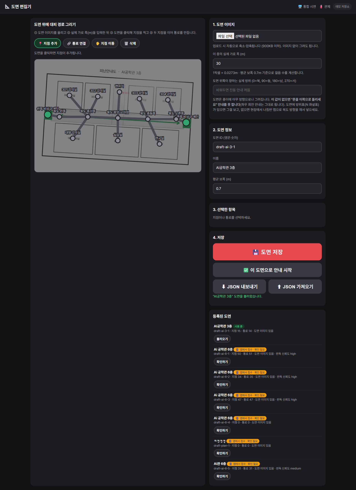

- 좌측 캔버스에 **실제 피난안내도 사진**을 배경으로 지점(원)·통로(선) 그래프가 겹쳐 보인다. 상단 도구는 📍 지점 추가 / 🔗 통로 연결 / ✋ 지점 이동 / 🗑️ 삭제 4모드.
- 우측 패널은 원본 설계서의 편집 5단계를 그대로 담는다:
  - **1. 도면 이미지** — 파일 업로드(자동 축소·압축 900KB 이하, 이미지 없이 그려도 됨), **이 층의 실제 가로 폭(m)** 입력(캡처: 30m → "1픽셀 = 0.0273m · 평균 보폭 0.7m 기준으로 걸음 수를 계산합니다"), **도면 위쪽이 향하는 실제 방위** 입력(placeholder: "비워두면 진동 안내 꺼짐" — 빈 칸과 0(북)은 다른 값).
  - **2. 도면 정보** — 도면 ID(`draft-ai-3-1`)·이름(AI공학관 3층)·평균 보폭(0.7m).
  - **3. 선택한 항목** — 지점/통로 선택 시 이름·유형·비콘 ID·따라갈 벽 편집 인스펙터.
  - **4. 저장** — 💾 도면 저장(검증 실행) / ✅ **이 도면으로 안내 시작**(활성화 🔒) / ⬇ JSON 내보내기 / ⬆ JSON 가져오기.
- **등록된 도면** 목록: 활성 도면에 초록 "사용 중" 배지, 앱에서 접수된 초안에는 주황 **"📱 앱에서 접수 · 확인 필요"** 배지와 판독 신뢰도(high/medium)가 붙는다. 초안은 "확인하기" 버튼만 있고 **"사용하기"(활성화) 버튼을 주지 않는다** — 눌러도 안 되는 버튼은 혼란만 주기 때문이며, 서버도 draft 활성화를 409로 거부한다.
- AI 판독기(탐지기/언어모델)가 연결되어 있으면 1단계에 **"✨ 도면에서 자동으로 읽어오기"** 버튼이 나타난다(캡처 환경은 미연결이라 숨김). 판독 결과는 저장되지 않고 캔버스에 올라올 뿐이며, 사람이 확인 후 저장해야 반영된다(Ⅶ장).

| UI 구역 | UI 요소 | 상세 명세 | 상태별 변화 |
|---|---|---|---|
| 캔버스 | 도면+그래프 | 클릭으로 지점 추가/연결/이동/삭제 | 모드 도구에 따라 |
| 1단계 | 이미지·폭·방위 | 축척 자동 계산 문구 노출. AI 읽기 버튼은 판독기 연결 시에만 | `GET /api/plans/reader`로 판단 |
| 2단계 | ID·이름·보폭 | 도면 메타데이터 | — |
| 3단계 | 인스펙터 | 지점 유형 5종·비콘 ID(중복 거부)·따라갈 벽 | 선택 시 표시 |
| 4단계 | 저장·활성화·JSON | 저장 시 검증(출구 없음/유령 통로/ID 중복 → 거부, 고립 지점 → 경고) | 활성화는 🔒 + draft 409 |
| 목록 | 등록된 도면 | 사용 중/draft 배지·지점·통로 수·판독 신뢰도·엔진 | 활성화 시 전 화면 SSE 전환 |

### 5.3.9 통합 시연 (발표용)

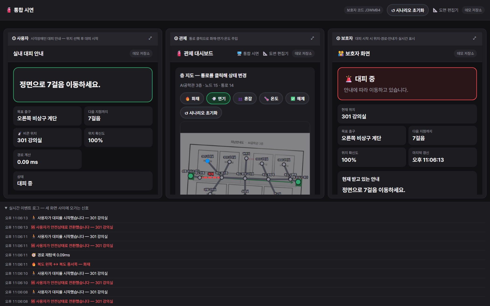

- 사용자·관제·보호자 **세 화면을 한 페이지에** 나란히 띄운다. 캡처는 실제 시연 흐름 그대로다: 사용자가 대피를 시작했고, 관제가 통로에 화재를 주입하자 **0.09ms에 재탐색**되어 목표 출구가 오른쪽 비상구 계단으로 바뀌었으며, 보호자 패널에 🚨 대피 중 배너와 **같은 안내 문구**("정면으로 7걸음 이동하세요.")가 실시간 표시되고 있다.
- 상단 배지에 **보호자 코드가 자동 연결**되어 있다(세 화면이 같은 출처라 사용자 ID를 공유) — 시연 중 코드를 옮겨 적을 필요가 없다.
- 하단 **실시간 이벤트 로그**에 세 화면 사이에 오가는 신호가 그대로 찍힌다 — 화면만 봐서는 "관제 클릭 → 사용자 재탐색 → 보호자 알림"의 인과가 잘 안 보이기 때문이다. 캡처의 로그: `🚶 사용자가 대피를 시작했습니다 — 301 강의실` → `🔥 복도 왼쪽 ↔ 복도 중서쪽 — 화재` → `🧭 경로 재탐색 0.09ms`.
- 패널 오른쪽 위 **⤢** 로 그 화면만 전체 폭으로 키우고, **↺ 시나리오 초기화**로 위험·온도 판독값을 한 번에 되돌린다.
- 프론트 개발 서버가 `/api/*`를 백엔드로 프록시하므로 같은 출처가 되어 CORS 설정 없이 SSE까지 그대로 흐르고, 백엔드를 안 띄우면 503 → **오프라인 폴백 시연**으로 그대로 쓸 수 있다.

## 5.4 모바일 화면 설계 (Expo iOS 앱)

모바일 6화면은 Expo Go 실기기(아이폰)에서 구동되므로 본 문서에는 화면별 상세 명세를 기술하고, 캡처는 실기기 스크린샷으로 추후 첨부한다.

| 화면 | 역할 | 핵심 설계 |
|---|---|---|
| CaptureScreen | 피난안내도 촬영 | 신분증 촬영 UX — 사각 틀, 정렬되면 초록 테두리+확인음(다른 앱에서 익힌 동작이라 설명 불요). 비스듬하면 사다리꼴 왜곡→축척이 위치마다 달라져 "9걸음"이 7걸음이 되므로 **롤(좌우 기울기)을 가장 엄하게** 판정(`alignment.js`), 위아래는 관대 |
| ReviewScreen | 찍은 사진 확인 | 손가락·반사광은 찍은 뒤에만 안다. 갤러리 사진은 `looksLikePlan` 거친 필터 + 애매하면 사용자에게 확인 |
| SubmitScreen | 접수 | 가로 폭(m) 입력 + **방위를 나침반으로 직접 측정** → `POST /api/plans/draft` 한 번에 (사진 저장+AI 판독+초안 생성이 서버에서 일괄 — 같은 사진을 두 번 올리지 않는다) |
| AlarmScreen | 화재 경보 | 화면 전체 덮음 — 사이렌·진동·음성·손전등. 사용자가 열지 않아도 스스로 열린다 |
| GuideScreen | 대피 안내 | 서버 경로를 구간마다 끊어 진동·소리로. 나침반 안정도(`STABILITY_FLOOR`) 미달 시 안내 중단·경고. 화면엔 큰 화살표·거리(동행자·저시력용 이중화) |
| StartScreen | 위치 수동 선택 | **예외 경로** — 비콘까지 실패했을 때만. 불난 상황에 강의실 13개를 하나씩 넘겨보게 하지 않는다 |

## 5.5 음성·진동 명령 체계

### 5.5.1 6개 명령

| 명령 | 진동 | 음성 예시 |
|---|---|---|
| 직진 | 짧게 1회 | "정면으로 9걸음 이동하세요. 오른쪽 벽을 따라가세요." |
| 우회전 | 짧게 2회 | "오른쪽으로 도세요. 그다음 12걸음 직진입니다." |
| 좌회전 | 짧게 3회 | "왼쪽으로 도세요. …" |
| 멈춤 | 길게 1회 | "멈추세요. 왼쪽으로 30도 돌려 통로를 찾으세요." |
| 위험 | 길게 3회 | "위험. 전방 통로 상태가 변경되었습니다." |
| 구조요청 | 매우 길게 2회 | "제자리에서 구조요청을 전송합니다. 이동하지 말고 대기하세요." |

캡처와의 대응: 5.3.3 명령 카드(직진), 5.3.4(위험→재탐색), 5.3.5(구조요청)가 각 명령의 화면 표현이다.

### 5.5.2 채널 분담 (모바일 방향 안내)

| 채널 | 전달하는 것 | 이유 |
|---|---|---|
| 소리 (스테레오 좌우, `sound.js` 합성 WAV) | **방향** (얼마나 돌려야 하는가) | 폰으로 방향을 줄 수 있는 유일한 수단. 음높이·패닝을 연속으로 바꿔야 해 파일 재생으로는 불가 — 메모리에서 WAV 합성 |
| 진동 (`haptics.js` HapticCompass) | **세기** (얼마나 맞는가) | 시끄러워도 전달된다. 진폭 5단계×빈도 곱으로 연속 세기 근사 — 정면 근처에서는 간격을 바닥까지 좁혀 끊기지 않는 느낌 (금속탐지기 원리) |

물리 전제: 진동 모터는 하나 — "왼쪽만 진동"은 불가능하므로 방향을 공간이 아니라 **시간축**에 담는다(폰을 돌리면 맞는 쪽에서 신호가 세짐, '나의 찾기' 원리). 방향을 찾는 건 사용자의 팔이고 폰은 "맞다/틀리다"만 답한다. 웹 사용자 앱의 **🧭 방향 확인 버튼**(5.3.3)이 같은 원리의 푸시-투-스캔 구현이다. 골전도 이어폰 전제 — 귀를 막지 않아 화재경보·사람 목소리를 함께 듣는다.

## 5.6 접근성 설계 규칙

| 규칙 | 내용 | 화면 반영 |
|---|---|---|
| VoiceOver를 대체하지 말고 활용 | `accessibilityLabel`을 바르게 붙이되, 대피 중에는 `announceForAccessibility()`로 **먼저 말을 건다** (VoiceOver는 손가락으로 짚어야 읽으므로) | 웹은 `aria-live` 카드(5.3.1·5.3.3) |
| 상태가 바뀔 때만 말한다 | 정렬 힌트는 문구가 바뀔 때만, 정면 진입/이탈은 상태가 뒤집힐 때만, 상황 요약은 30초 1회 | 보호자 알림도 전이 시에만(5.3.7) |
| 연속 배경음 금지 | 화재경보·사람 목소리·지팡이 소리(청각적 시야)를 가리는 안내는 위험 | 방향 확인은 **누르는 동안만** 신호(5.3.3) |
| 두 사용자를 함께 섬긴다 | 큰 화살표·지도는 동행자·저시력용, 같은 정보가 진동·소리로도 — 이중화 유지 | 동행 안전요원용 지도(5.3.3.1) |
| 잠정값 비발화 | 측위 확정 전(locked=false) 값은 표시·발화하지 않는다 | 시작 화면 판정 카드(5.3.1) |

---

# Ⅵ. 데이터 및 API 설계

## 6.1 저장소 아키텍처 (Repository 패턴)

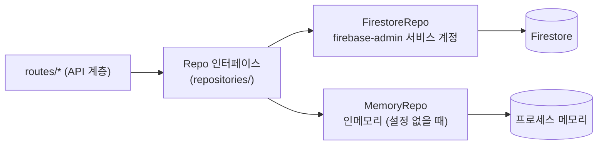
```mermaid
flowchart LR
  R["routes/* (API 계층)"] --> I["Repo 인터페이스<br/>(repositories/)"]
  I --> FSR["FirestoreRepo<br/>firebase-admin 서비스 계정"]
  I --> MEM["MemoryRepo<br/>인메모리 (설정 없을 때)"]
  FSR --> DB[("Firestore")]
  MEM --> RAM[("프로세스 메모리")]
```

- 두 구현은 **동일 인터페이스**다. Firebase 설정이 없으면 인메모리로 뜨고 실시간 전파(SSE)·재탐색·구조요청까지 전부 동작한다 — 시연에 충분하며, 여러 기기를 같은 Wi-Fi에 붙이면 서로 실시간 연동된다.
- 연결 성공 시 로그 `[repo] Firestore 연결됨`으로 확인한다.

## 6.2 데이터 모델

### 6.2.1 FloorPlan JSON 스키마 (도면의 단일 형식 — `POST /api/plans`와 동일)

```jsonc
{
  "id": "office-5f", "name": "사무동 5층",
  "metersPerUnit": 0.04,          // 도면 1px = 4cm (사람이 입력한 가로 폭에서 계산)
  "stepLength": 0.7,              // 보폭(m) — 거리→걸음 수 변환
  "northOffset": 130,             // 도면 위쪽의 실제 방위(선택 — 빈 칸과 0은 다른 값)
  "image": { "width": 1400, "height": 900 },   // + data URI는 별도 API로 관리
  "nodes": [
    { "id": "R1", "name": "501호 회의실 앞", "x": 300, "y": 700,
      "type": "room", "beaconId": "BC-501" }
  ],
  "edges": [
    { "id": "C1", "a": "R1", "b": "H1", "wall": "right", "elevator": false }
  ]
}
```

| 필드 | 규칙 |
|---|---|
| `nodes[].type` | `room` `junction` `exit` `elevator` `stair` — **`exit`가 대피 목표**(`FloorPlan.exitNodes`) |
| `edges[].elevator` | `true`면 화재 모드에서 자동 제외 |
| `edges[].wall` | 따라갈 벽 좌/우 — 안내 문구에 사용 |
| `nodes[].beaconId` | 비콘 매핑. 중복 시 저장 거부. 하나도 없으면 가상 비콘 시뮬레이션 |
| 검증(거부) | 출구 없음 / 없는 지점을 잇는 통로 / id 중복 |
| 검증(경고) | 출구까지 이어지지 않는 고립 지점 (편집 중일 수 있어 저장은 허용) |

### 6.2.2 Firestore 컬렉션 관계도

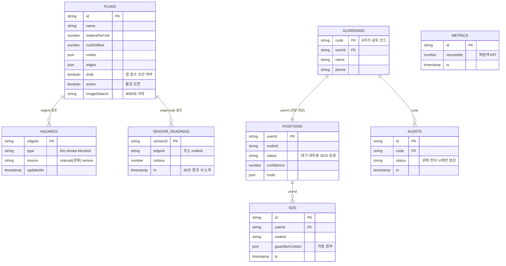
```mermaid
erDiagram
  PLANS {
    string id PK
    string name
    number metersPerUnit
    number northOffset
    json nodes
    json edges
    boolean draft "앱 접수 초안 여부"
    boolean active "활성 도면"
    string imageDataUri "900KB 이하"
  }
  HAZARDS {
    string edgeId PK
    string type "fire·smoke·blocked"
    string source "manual(관제)·sensor"
    timestamp updatedAt
  }
  SENSOR_READINGS {
    string sensorId PK
    string edgeId "또는 nodeId"
    number celsius
    timestamp ts "60초 경과 시 노후"
  }
  POSITIONS {
    string userId PK
    string nodeId
    string status "대기·대피중·SOS·완료"
    number confidence
    json route
  }
  SOS {
    string id PK
    string userId FK
    string nodeId
    json guardianContact "자동 첨부"
    timestamp ts
  }
  GUARDIANS {
    string code PK "6자리 공유 코드"
    string userId FK
    string name
    string phone
  }
  ALERTS {
    string id PK
    string code FK
    string status "상태 전이 시에만 생성"
    timestamp ts
  }
  METRICS {
    string id PK
    number rerouteMs "재탐색 KPI"
    timestamp ts
  }
  PLANS ||--o{ HAZARDS : "edgeId 참조"
  PLANS ||--o{ SENSOR_READINGS : "edge/node 참조"
  POSITIONS ||--o{ SOS : "userId"
  GUARDIANS ||--o{ ALERTS : "code"
  GUARDIANS ||--|| POSITIONS : "userId (관찰 대상)"
```

※ 인메모리 모드에서는 같은 구조를 프로세스 메모리에 유지한다. 온도 판독값은 임계·노후 판정과 함께 `hazards`로 **병합되어** 경로탐색에 반영된다(더 심각한 쪽 채택).

## 6.3 REST API 명세

베이스: 개발 `http://localhost:5173/api/*` (→ :8080 프록시), 통합 `:8080`. 🔒 = `ADMIN_TOKEN` 설정 시 `x-admin-token` 헤더 필요.

### 6.3.1 상태·지도·경로

| 메서드 | 경로 | 설명 |
|---|---|---|
| GET | `/api/health` | 서버·저장소 모드 확인 |
| GET | `/api/map` | 현재 활성 도면 (노드·통로·축척·northOffset) |
| POST | `/api/route` | `{from, kind}` → 접근가능 최단 출구 경로 + 계산시간. `route: null`이면 안전한 길이 없다는 뜻 |

### 6.3.2 도면

| 메서드 | 경로 | 설명 |
|---|---|---|
| GET | `/api/plans` | 등록된 도면 목록 |
| POST | `/api/plans` | **도면 주입** (검증 후 저장) 🔒 — BIM/CAD 내보내기 연동 지점 |
| POST | `/api/plans/draft` | 앱 접수 — `{name, dataUri, width, height, widthM, northOffset?}` → `{planId, nodes, edges, exits, rooms, confidence, warnings, needsReview}`. **관제 권한 불요** |
| POST | `/api/plans/read` | 판독만 — `{dataUri, width, height}` → `{nodes, edges, confidence, engine, notes, warnings, buildingName, floorLabel}` |
| GET | `/api/plans/reader` | 판독기 상태 → `{configured, available, engine, detector, model, reason}` |
| PUT | `/api/plans/:id/activate` | 이 도면으로 안내 시작 🔒 (draft면 409) |
| DELETE | `/api/plans/:id` | 도면 삭제 (사용 중이면 409) 🔒 |
| GET/PUT | `/api/plans/:id/image` | 도면 이미지 (data URI) |

### 6.3.3 위험·센서

| 메서드 | 경로 | 설명 |
|---|---|---|
| GET | `/api/hazards` | 현재 위험 상태 (관제 지정 + 센서 판정 통합) |
| GET | `/api/hazards/manual` | 관제가 직접 지정한 위험만 (감사용) |
| PUT | `/api/hazards/:edgeId` | `{type}` 위험 설정 🔒 |
| DELETE | `/api/hazards/:edgeId` | 위험 해제 🔒 |
| POST | `/api/hazards/reset` | 시나리오 초기화 🔒 |
| POST | `/api/sensors/temperature` | 온도 판독 수집 `{sensorId, edgeId|nodeId, celsius}` → 임계 초과 시 자동 회피 |
| GET | `/api/sensors` | 판독값 목록 (임계 판정·노후 여부 포함) |
| DELETE | `/api/sensors/:id` · POST `/api/sensors/reset` | 판독값 삭제 |
| POST | `/api/sensors/fire-panel` | 화재수신기·BMS 웹훅 (건물 연동 자리) |

### 6.3.4 대피자·보호자·운영

| 메서드 | 경로 | 설명 |
|---|---|---|
| GET/POST | `/api/sos` | 구조요청 조회·전송 (보호자 연락처 자동 첨부) |
| GET/PUT | `/api/positions[/:userId]` | 대피자 위치 (상태 전이 시 보호자 알림 생성) |
| GET/POST | `/api/metrics` | 재탐색 시간 KPI |
| POST | `/api/guardians` | 보호자 등록 → 공유 코드 발급 |
| GET | `/api/guardians/:userId` | 등록된 보호자 조회 |
| GET | `/api/guardian/:code` | 보호자 화면 진입 (대상자 현재 상태) |
| GET | `/api/alerts` | 보호자 알림 이력 |
| GET | `/api/stream` | **SSE** — 변경 실시간 push (`?code=`로 보호자 스코프) |

### 6.3.5 모바일 앱이 사용하는 부분집합

```
GET  /api/positions            내 위치 (비콘 게이트웨이·관제가 올린 값)
POST /api/plans/draft          찍은 도면 접수 → AI 판독 → 초안 (확인 전이라 안내엔 안 쓰임)
GET  /api/map                  활성 도면 (노드·통로·축척·northOffset)
POST /api/route {from, kind}   경로 — route: null이면 안전한 길이 없다는 뜻
GET  /api/hazards              3초마다 확인 → 가던 길에 불이 붙으면 재탐색
POST /api/sos                  안내를 멈출 때 보호자·관제에 알림
```

서버 주소는 Expo 개발 서버 호스트에서 알아낸다(`serverUrl.js`) — 맥 IP를 코드에 적으면 DHCP 변경 때마다 "요청 시간 초과"가 난다(실제 2회 겪음). 배포 시 `EXPO_PUBLIC_FIRE_SERVER`로 고정.

## 6.4 SSE 이벤트 설계

| 항목 | 설계 |
|---|---|
| 엔드포인트 | `GET /api/stream` — `events.js` 내부 이벤트 허브가 브로드캐스트 |
| 전파 대상 | 위험 변경, 온도 판독, 도면 활성화, 위치·상태 전이, SOS, 알림 |
| 스코프 | `?code=` 지정 시 그 코드의 대상자 관련 이벤트만 (보호자). 다른 대피자 위치·운영 지표 제외 |
| 재연결 | 브라우저 EventSource 내장 자동 재연결 → 실패 지속 시 오프라인 폴백 |
| 같은 출처 | dev 프록시·배포 rewrite로 CORS 없이 흐른다 |

## 6.5 오류 응답·상태 코드 설계

| 코드 | 상황 | 클라이언트 처리 |
|---|---|---|
| 401/403 | `ADMIN_TOKEN` 불일치 (🔒 API) | 관제 인증 안내 |
| 409 | 사용 중 도면 삭제 / draft 활성화 / 비콘 중복·검증 실패 | 사유 표시, 확인 유도 |
| 503 | 백엔드 미기동(프록시) / 판독기 시야 점검 실패 | 오프라인 폴백 전환 / "그림 미전달" 안내 |
| `route: null` | 접근 가능 경로 없음 (오류 아님) | 안전상태 전환 + SOS |
| `null` 반환 (모바일 api.js) | 서버 실패를 예외가 아니라 null로 | 폴백 경로 진입 + 사실 고지 |
---

# Ⅶ. AI 기능 설계

## 7.1 도면 판독 개요 — 두 모델의 분업

피난안내도에는 비상구도, 현 위치도, 피난경로 화살표도 **이미 그려져 있다.** 지점을 찍는 일은 없던 정보를 만드는 게 아니라, 그림으로만 있는 것을 좌표로 **옮겨 적는** 작업이고, 그 옮겨 적기를 AI에게 시킨다. 성격이 다른 두 모델이 **각자 잘하는 것만** 한다.

| | 기호 탐지기 (`ml/detector`) | 언어모델 (Gemini · Claude) |
|---|---|---|
| 하는 일 | 비상구·계단·실·문이 **어디 있는지** | 적힌 **이름**과 **통로 연결** |
| 방식 | 피난안내도로 직접 학습시킨 YOLO 두 벌 | 도면의 복도 선·초록 피난경로 화살표를 읽음 |
| 못 하는 것 | 글자를 못 읽고 통로도 모름 | 좌표가 눈대중이라 몇십 px씩 어긋남 |

> **좌표는 탐지기, 이름과 통로는 언어모델.** 언어모델 지시문에서 좌표를 다시 묻지 않는 것이 핵심이다 — 다시 말하게 하면 더 나빠진다.

| 붙어 있는 것 | 결과 |
|---|---|
| 둘 다 | 탐지기가 찍은 지점 위에 언어모델이 이름·통로를 얹는다 (가장 정확) |
| 탐지기만 | 지점은 정확, 통로는 기하학적 추정, 이름은 번호(`실 1`, `비상구 2`…) |
| 언어모델만 | 좌표까지 언어모델이 읽는다 |
| 둘 다 없음 | 판독을 시작하지 않고 손으로 그리기로 넘어간다 |

효과: 도면 하나 등록 **10분 → 1분**. 실제 사진(AI공학관 3층, 1100×744)으로 CPU 3.5초에 지점 16곳·통로 16개 — 손으로 찍었던 15곳과 비슷한 수.

## 7.2 기호 탐지기 (ml/detector — FastAPI + YOLO 2벌)

### 7.2.1 왜 모델이 두 벌인가

한 벌로 여덟 클래스를 다 학습시켰더니 일부 클래스가 서로를 잡아먹었다. 라운드를 나눠 학습시키고 각 라운드가 **자신 있는 클래스만** 맡은 뒤, 클래스별 NMS로 중복을 정리한다(`hybrid_detector.py`).

| 모델 | 맡는 클래스 |
|---|---|
| `round2_best.pt` | 0 exit · 2 elevator · 3 extinguisher · 4 hydrant · 6 door · 7 room |
| `round4_guarded_best.pt` | 1 stair · 5 you_are_here |

클래스 순서(0~7): `0 exit · 1 stair · 2 elevator · 3 extinguisher · 4 hydrant · 5 you_are_here · 6 door · 7 room`

> **클래스 순서는 두 모델이 같아야 한다.** 시작할 때 검사해서 어긋나면 뜨지 않는다 — 순서가 밀리면 "비상구"라고 찍은 것이 실제로는 "소화기"가 되고, 그 오류는 도면이 저장된 뒤에야 드러난다. 재학습 시 `CLASS_NAMES`·`ROUND2_CLASSES`·`ROUND4_CLASSES`를 함께 갱신하고 `GET /health`로 검사 통과를 확인한다.

### 7.2.2 API

| 엔드포인트 | 요청/응답 |
|---|---|
| `GET /health` | `{ok, device, classes, models}` — `ok:false`면 `reason`을 백엔드가 그대로 편집기에 표시 |
| `POST /detect` | `{dataUri}` → `{detections:[{classId, className, confidence, box, sourceModel}], counts, imageSize}` |

`box`는 **0~1 정규화** `[x1,y1,x2,y2]` — 픽셀 그대로 주면 편집기 축소 배율과 어긋났을 때 지점이 도면 밖에 찍히고, 그 오류는 사람이 화면을 봐야만 알아챈다.

### 7.2.3 설정 (환경변수)

| 변수 | 기본값 | 설명 |
|---|---|---|
| `ROUND2_MODEL` / `ROUND4_MODEL` | `models/round2_best.pt` / `models/round4_guarded_best.pt` | 가중치 경로 |
| `DETECT_CONF` | `0.25` | 확신도 문턱 — **낮게** 잡는다: 흐리거나 기운 사진은 확신도가 통째로 내려가고, 놓친 출구는 사람이 알아채기 어렵다. 많이 건지고 걸러내기는 사람이 편집기에서 |
| `DETECT_IOU` | `0.50` | NMS IoU |
| `DETECT_IMGSZ` | `768` | 추론 해상도 |
| (백엔드) `DETECTOR_URL` | `http://127.0.0.1:8001` | 탐지기 주소 |
| (백엔드) `DETECTOR_MIN_CONFIDENCE` | — | 백엔드 2차 필터 |

성능: GPU 자동 사용(`torch.cuda.is_available()`), CPU 5~15초/장(두 모델 순차) — 편집기는 "20초~1분"으로 안내. **이 서비스가 꺼져 있어도 도면 등록은 계속 된다** — 탐지기 하나 때문에 등록 전체가 막히면, 사진 찍으러 그 건물까지 걸어간 사람이 헛걸음한다.

## 7.3 언어모델 판독 (backend/planReader/providers.js)

| 항목 | 설계 |
|---|---|
| 공급자 | `GOOGLE_API_KEY`(무료, aistudio) 또는 `ANTHROPIC_API_KEY` — **Google이 있으면 우선.** 모델 기본값 `gemini-2.5-flash` / `PLAN_READER_MODEL`로 변경 |
| 직접 연결 권장 | 게이트웨이(`ANTHROPIC_BASE_URL` 경유 OpenRouter·monogpt 등)는 이미지를 조용히 버릴 수 있다 (7.6) |
| 지시문 원칙 | 좌표를 다시 묻지 않는다. 이름·통로 연결·건물명·층 라벨·신뢰도·메모만 |
| 버튼 노출 | 둘 중 하나라도 붙으면 편집기 1단계에 "✨ 자동으로 읽어오기" 버튼 표시. 둘 다 없으면 버튼 자체가 안 보인다 |

## 7.4 하이브리드 판독 파이프라인 (backend/planReader.js)

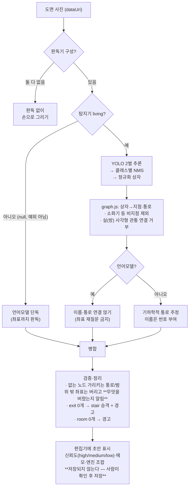
```mermaid
flowchart TB
  IN["도면 사진 (dataUri)"] --> CHK{"판독기 구성?"}
  CHK -- "둘 다 없음" --> MANUAL["판독 없이<br/>손으로 그리기"]
  CHK -- "있음" --> DET{"탐지기 living?"}
  DET -- "예" --> Y["YOLO 2벌 추론<br/>→ 클래스별 NMS<br/>→ 정규화 상자"]
  DET -- "아니오 (null, 예외 아님)" --> LLMONLY
  Y --> GR["graph.js: 상자→지점·통로<br/>· 소화기 등 비지점 제외<br/>· 실(방) 사각형 관통 연결 거부"]
  GR --> LLM{"언어모델?"}
  LLMONLY["언어모델 단독<br/>(좌표까지 판독)"] --> MERGE
  LLM -- "예" --> NAME["이름·통로 연결 얹기<br/>(좌표 재질문 금지)"] --> MERGE["병합"]
  LLM -- "아니오" --> GEO["기하학적 통로 추정<br/>이름은 번호 부여"] --> MERGE
  MERGE --> VAL["검증·정리<br/>· 없는 노드 가리키는 통로/범위 밖 좌표는 버리고 **무엇을 버렸는지 알림**<br/>· exit 0개 → stair 승격 + 경고<br/>· room 0개 → 경고"]
  VAL --> OUT["편집기에 초안 표시<br/>신뢰도(high/medium/low)·메모·엔진 조합<br/>**저장되지 않는다 — 사람이 확인 후 저장**"]
```

- **실 관통 금지**: 탐지기 단독 통로 추정 시 실(방) 사각형을 가로지르는 연결은 거부한다 — 방은 벽으로 둘러싸인 공간이라 그 안을 관통하는 복도는 없다. 끊긴 곳은 벽을 뚫어 잇지 않고 끊겼다고 알린다 — 없는 통로를 만들면 시각장애인이 벽으로 걸어간다.
- **stair 승격 경고**: 비상계단을 `stair`로 찍어 오는 일이 있다. 대피 목표는 `exit`뿐이라 그대로 두면 갈 곳이 없어진다. `exit`이 0개면 `stair`를 승격하되 경고한다 — 옥상 전용 계단이 섞였을 수 있고 그건 사람만 안다.
- **room 경고**: 방이 없으면 안내를 시작할 수 없다 — 위치 폴백 목록이 방 이름이기 때문이다.
- **축척 비판독**: 사진에 안 적혀 있어 문 폭·복도 폭으로 어림할 수는 있지만, 두 배 틀리면 "8미터 직진"이 16미터가 된다. 이 숫자 하나는 사람이 넣는다.
- **확인은 마지막 방어선**: 결과는 저장되지 않고 편집기에 올라올 뿐이다. 비상구 하나를 잘못 찍으면 시각장애인이 벽으로 걸어가므로, 확인 단계는 요식이 아니라 의도적으로 건너뛸 수 없게 했다.

## 7.5 게이트웨이 시야 점검 (Vision Check)

게이트웨이가 이미지 블록을 조용히 버리면, 모델은 그림을 못 본 채 그럴듯한 도면을 지어내고 신뢰도까지 `high`로 보고한다 (monogpt의 claude-code 프로필 + `gemini-3.5-flash` 조합에서 실제 발생). **판독이 안 되는 것보다 안 된 걸 모르는 쪽이 훨씬 위험하다.**

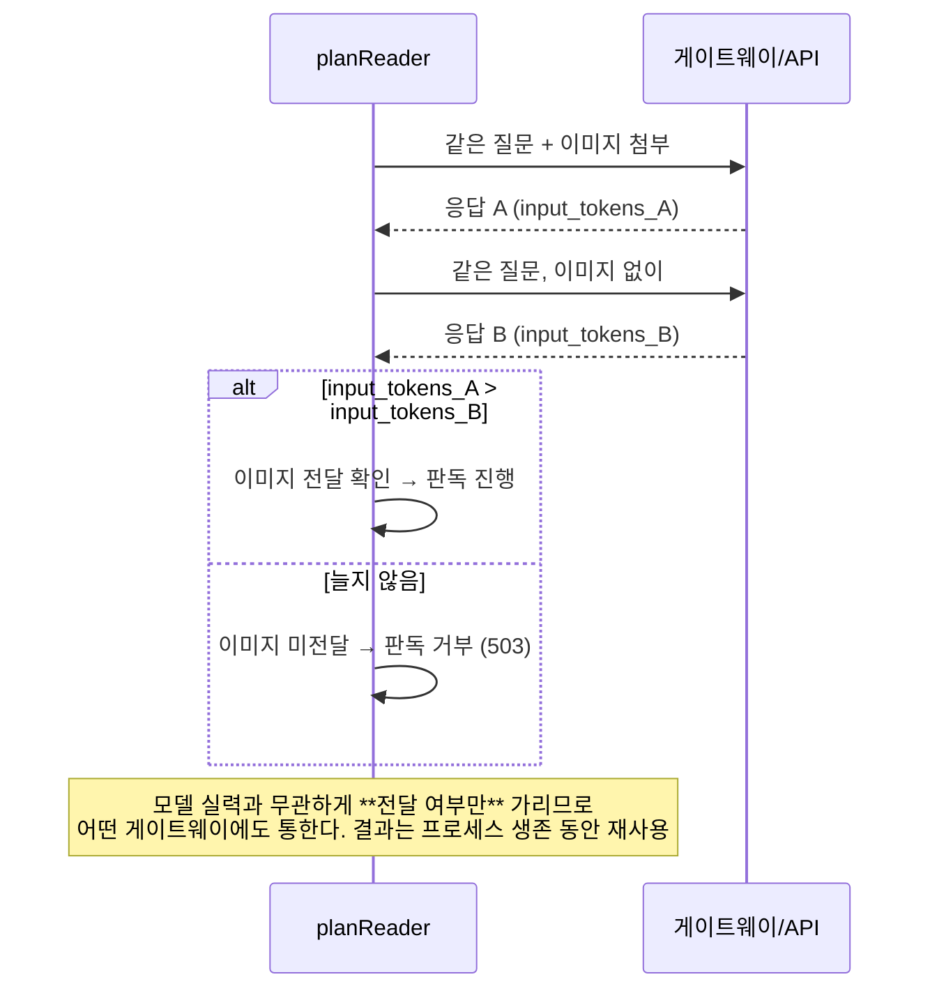
```mermaid
sequenceDiagram
  participant PR as planReader
  participant GW as 게이트웨이/API
  PR->>GW: 같은 질문 + 이미지 첨부
  GW-->>PR: 응답 A (input_tokens_A)
  PR->>GW: 같은 질문, 이미지 없이
  GW-->>PR: 응답 B (input_tokens_B)
  alt input_tokens_A > input_tokens_B
    PR->>PR: 이미지 전달 확인 → 판독 진행
  else 늘지 않음
    PR->>PR: 이미지 미전달 → 판독 거부 (503)
  end
  Note over PR: 모델 실력과 무관하게 **전달 여부만** 가리므로<br/>어떤 게이트웨이에도 통한다. 결과는 프로세스 생존 동안 재사용
```

## 7.6 측정된 정확도

정답을 아는 시험 도면(AI공학관 3층, 비상구 2곳·복도 교차점) 기준, `gemini-3.5-flash`.

| 입력 | 점수 | 비상구 오차 | 교차점 오차 | 시간 |
|---|---|---|---|---|
| 깨끗한 도면 이미지 | 4/4 | 1.0% | 0.7% | 15초 |
| 폰 사진처럼 (3.5° 기울기·반사광·흐림·JPEG 70%) | 4/4 | 0.4~0.9% | 1.1% | 19초 |

사진이 망가져도 정확도가 거의 안 떨어졌다 — 피난안내도가 **선·색 위주의 규격 그림**이라 압축·흐림에 강한 덕이다. 읽어낸 도면을 그대로 저장·활성화하고 경로까지 계산되는 것을 확인했다: `301 강의실 → 서쪽 복도 교차점 → 서쪽 비상구 계단 (12.75m)`.

## 7.7 향후 AI 과제

| 과제 | 현재 상태 | 계획 |
|---|---|---|
| 대피도 판별 모델 | `looksLikePlan` 거친 필터 (명백히 아닌 것만 거름) — 판별 AI를 학습시키려고 사진을 모으는 중이라 엄격하면 데이터가 안 쌓이는 순환 문제 | 데이터 축적 후 판별 모델로 함수만 교체 |
| 탐지기 재학습 | 코랩 학습 가중치 2벌 | 수집 사진으로 증분 학습, 클래스 순서 유지 검사 |
| 통로 자동 추정 고도화 | 기하학적 추정 + 실 관통 금지 | 복도 선 분할 모델 검토 |

---

# Ⅷ. 개발 및 협업 계획

## 8.1 개발 환경 명세

| 구분 | 내용 |
|---|---|
| 런타임 | Node.js ≥ 20 (npm workspaces: 루트+`backend/`), Python 3.x(탐지기), Expo SDK 54(모바일) |
| IDE | VS Code — **백엔드는 F5**(실행 구성 `백엔드 실행·디버그`, :8080)로 중단점 디버깅. `.vscode/launch.json`에 각 테스트 실행 구성 포함 |
| 모바일 테스트 | 아이폰 + Expo Go — `npx expo start --lan --port 8081` 후 `exp://<맥IP>:8081`. Xcode 불필요. 번들 확인: `curl .../App.js.bundle?platform=ios` |
| 브라우저 | 크롬 (BLE 실기기 데모는 `chrome://flags` 실험 플래그 켠 안드로이드 크롬 1대) |

### 실행 방식

| 실행 방식 | 명령 | 용도 |
|---|---|---|
| 프론트 | `npm run dev` | :5173, `/api`는 :8080으로 프록시 |
| 백엔드 | VS Code **F5** | :8080, 디버거 연결 |
| 백엔드(터미널) | `npm run dev:backend` | 디버거 없이 자동 재시작 (`node --watch`) |
| 통합 1포트 | `npm start` | `sync` 후 :8080 하나로 프론트까지 서빙 (시연·배포 확인) |
| 탐지기 | `npm run detector` (venv 활성화 후) | uvicorn :8001 |
| 공용 코드 동기화 | `npm run sync` | `shared/` → `frontend/shared/` 복사 (배포용 — 개발 중엔 원본 직접 서빙) |
| 테스트 | `npm test` | sync 후 route·positioning·plan-reader·backend api 순차 |

포트가 이미 쓰이면: 이전 실행이 남아 있으면 그 사실을 알리고 기존 서버 사용을 안내, 다른 프로그램 점유면 다음 포트로 이동. 직접 비우기 `npx kill-port 5173`, 포트 변경 `FRONTEND_PORT=3000 npm run dev`.

## 8.2 소스 디렉터리 구조

```
shared/                     ← 백엔드·프론트 공용 (단일 진실 소스)
├── floor-plan.js           FloorPlan 모델 · 도면 검증 · 축척/방위/걸음 수 · 비콘 매핑
├── hazard-rules.js         위험 등급 · 온도 임계값 · 센서→위험 변환 · 병합
├── pathfinding.js          Dijkstra — Anyplace 포팅 + 차단엣지/엘리베이터 제외
├── positioning.js          비콘 측위 — 최근접 판정 · 스무딩 · 히스테리시스
└── beacon-sim.js           가상 비콘 — 거리 기반 RSSI + 노이즈 (기기 없이 검증)

backend/
├── src/
│   ├── server.js           진입점
│   ├── app.js              Express 앱 (테스트용 분리)
│   ├── config.js           환경변수
│   ├── floor.js            활성 도면 + 통합 위험 상태 (관제 + 센서)
│   ├── events.js           내부 이벤트 허브 → SSE
│   ├── guardian-code.js    보호자 공유 코드 생성
│   ├── planReader.js       도면 판독 — 탐지기와 언어모델을 합치는 이음매
│   ├── planReader/
│   │   ├── detector.js     ml/detector 호출 (꺼져 있으면 null, 예외 아님)
│   │   ├── graph.js        탐지 상자 → 지점·통로 (실을 관통하는 연결은 거부)
│   │   └── providers.js    Anthropic 규격 · Google 직접 연결
│   ├── middleware/auth.js  관제 토큰 검증
│   ├── repositories/       FirestoreRepo | MemoryRepo (동일 인터페이스)
│   └── routes/             evacuation · hazards · sensors · plans · telemetry · guardians · stream
└── test/api.test.mjs       API 통합 테스트 56종

ml/detector/                ← 도면 기호 탐지 (파이썬 · 별도 프로세스)
├── app.py                  FastAPI — /health · /detect
├── hybrid_detector.py      두 모델 결과 합치기 + 클래스별 NMS
└── models/*.pt             학습된 YOLO 가중치 두 벌

frontend/
├── demo.html               통합 시연 (세 화면 + 이벤트 로그) ← 발표용
├── index.html              사용자 앱 (큰 버튼, aria-live, 고대비) + 보호자 등록
├── admin.html              관제 대시보드 (화재·온도 시뮬레이션)
├── guardian.html           보호자 화면
├── architect.html          도면 편집기 (설계도 주입)
├── js/
│   ├── api.js              REST + SSE 클라이언트 · 도면 캐시 · 오프라인 폴백
│   ├── app.js              대피 상태머신 (안내→이탈감지→재탐색→안전상태)
│   ├── beacon.js           비콘 주기 스캔 → 현재 지점 판정 → 앱 통지
│   ├── admin.js            화재·온도 시뮬레이션 · 센서/SOS/KPI 모니터
│   ├── architect.js        도면 이미지 업로드 · 지점/통로 편집 · JSON 입출력
│   ├── demo.js             보호자 코드 자동 연결 · 크로스 화면 이벤트 로그
│   ├── guardian.js         대상자 실시간 추적 · 상태 알림
│   ├── guidance.js         음성(TTS)·진동 6개 명령
│   ├── odometry.js         걸음감지·방위추적·확신도
│   └── minimap.js          SVG 층 지도 (도면 배경 · 온도 배지)
├── sw.js                   오프라인 캐시 (/api/* 는 캐시 금지)
└── manifest.json           PWA

mobile/                     ← 아이폰 앱 (Expo)
├── App.js                  phase 전환 (평소 촬영 ↔ 화재 안내)
└── src/
    ├── screens/            Capture · Review · Submit · Alarm · Guide · Start
    ├── haptics.js          진동 엔진 — HapticCompass (진폭×간격), setEngine()
    ├── bearing.js          자력계 방위 · 안정도 · 정확도/근접도
    ├── sound.js            합성음 — WAV 메모리 생성 (음높이·패닝 연속 제어)
    ├── api.js / serverUrl.js / fireServer.js   서버 통신 (실패는 null) · 주소 자동 탐지 · 연동 규격
    ├── locator.js / beaconLocator.js / positioning.js / beaconSim.js   측위 계층
    ├── odometry.js / route.js / pathfinding.js / demoPlan.js   걸음·경로 변환 · 로컬 폴백
    ├── alignment.js / crop.js / calibrate.js   촬영 정렬 · 가공
    ├── announce.js / theme.js                  접근성 발화 · 색 토큰
    └── …

scripts/
├── dev-server.mjs          프론트 개발 서버 (정적 서빙 + /api 프록시)
└── sync-shared.mjs         shared/ → frontend/shared/ 복사 (배포용)

.vscode/launch.json         F5 실행 구성 (백엔드 · 각 테스트)
test/route.test.mjs         경로탐색 시나리오
test/positioning.test.mjs   비콘 측위 — 깜빡임·전환 순서·순간이동 억제
test/plan-reader.test.mjs   탐지 결과 → 그래프 (소화기 제외 · 실 관통 금지)
vendor/                     참고한 오픈소스 원본 (MIT)
firebase.json · firestore.rules
```

## 8.3 테스트 전략

| 테스트 | 파일 | 내용 |
|---|---|---|
| 경로탐색·도면·온도 30종 | `test/route.test.mjs` | 시나리오별 경로·차단·가중치·검증 |
| 측위 | `test/positioning.test.mjs` | 합성 RSSI 시퀀스 — 깜빡임·전환 순서·순간이동 억제 |
| 판독 그래프 | `test/plan-reader.test.mjs` | 탐지 상자→그래프 — 소화기 제외·실 관통 금지 |
| 백엔드 API 56종 | `backend/test/api.test.mjs` | 전 엔드포인트 통합 |

설계 원칙:

- 측위 계층은 **시간을 인자로 받는다** — 테스트가 시간을 감아야 히스테리시스를 검증할 수 있다.
- 시뮬레이션 노이즈(±6dB, 유실 15%)를 실측 수준보다 **줄이지 말 것** — 시뮬레이션에서만 통과하는 측위는 현장에서 처음 실패하고, 그때는 원인이 노이즈인지 로직인지 가릴 수 없다.
- `app.js`를 `server.js`에서 분리해 서버 기동 없이 API를 테스트한다.

## 8.4 개발 일정 및 WBS (4주)

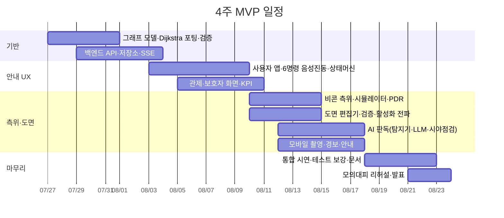
```mermaid
gantt
  title 4주 MVP 일정
  dateFormat  YYYY-MM-DD
  axisFormat  %m/%d
  section 기반
  그래프 모델·Dijkstra 포팅·검증     :a1, 2026-07-27, 5d
  백엔드 API·저장소·SSE              :a2, 2026-07-29, 6d
  section 안내 UX
  사용자 앱·6명령 음성진동·상태머신   :b1, 2026-08-03, 7d
  관제·보호자 화면·KPI               :b2, 2026-08-05, 6d
  section 측위·도면
  비콘 측위·시뮬레이터·PDR           :c1, 2026-08-10, 5d
  도면 편집기·검증·활성화 전파        :c2, 2026-08-10, 5d
  AI 판독(탐지기·LLM·시야점검)       :c3, 2026-08-12, 6d
  모바일 촬영·경보·안내              :c4, 2026-08-12, 6d
  section 마무리
  통합 시연·테스트 보강·문서          :d1, 2026-08-18, 5d
  모의대피 리허설·발표               :d2, 2026-08-21, 3d
```

| WP | 작업 패키지 | 산출물 | 선행 |
|---|---|---|---|
| WP-01 | 지도 그래프·경로탐색 (`shared/`) | pathfinding·floor-plan + route.test | — |
| WP-02 | 백엔드 API·저장소·SSE | routes·repositories + api.test 56종 | WP-01 |
| WP-03 | 사용자 앱·안내 UX | index.html·guidance·app 상태머신 | WP-02 |
| WP-04 | 관제·보호자·통합 시연 | admin·guardian·demo | WP-02 |
| WP-05 | 측위 (비콘·시뮬·PDR) | positioning·beacon-sim + positioning.test | WP-01 |
| WP-06 | 도면 편집기·주입 | architect + 검증 규칙 | WP-02 |
| WP-07 | AI 판독 | planReader·ml/detector + plan-reader.test | WP-06 |
| WP-08 | 모바일 앱 | mobile/ 6화면·햅틱·사운드 | WP-02, WP-05 |
| WP-09 | 통합·리허설·발표 | demo 시나리오 0~9 완주 | 전체 |

담당 배분은 팀 구성(2인+)에 맞춰 트랙별(백엔드·AI / 프론트·모바일)로 나누고, 각 WP에 백업 담당자를 지정한다.

## 8.5 협업 규칙

| 항목 | 규칙 |
|---|---|
| 브랜치 | `main`(안정) ← 기능 브랜치(`feature/positioning-plan-reader` 등)·개인 브랜치(`Test-ys`) PR 병합 |
| 문서 SoT | 개요·실행법·API·데모 시나리오는 **README.md가 단일 진실 소스.** CLAUDE.md에는 README에 없는 **설계 결정만** 적는다 |
| 코드 공유 경계 | 지도·알고리즘 수정은 반드시 `shared/`에서 — 프론트 사본 직접 수정 금지 (sync가 덮는다) |
| 리뷰 관점 | 안전 불변식 유지 — 안내 중단 안전장치 제거 금지, 없는 통로 생성 금지, 잠정값 발화 금지 |
| 시연 | 발표 전 데모 시나리오 0~9 전 단계 리허설, `↺ 시나리오 초기화`로 복원 확인 |

## 8.6 데모 시나리오 (발표용)

**http://localhost:5173/demo.html 한 화면에서 전부 보여줄 수 있다.** 병원 3층, 301호 진료실 앞 화재경보. 초기 상태: 계단 A(동쪽) 연기 감지, 엘리베이터 자동 제외.

| 단계 | 조작 | 기대 동작 |
|---|---|---|
| 0 | 앱 열기 (조작 없음) | 📡 비콘이 현재 지점을 스스로 판정 → "현재 위치는 301호 진료실 앞입니다" 음성 + 대피 시작 버튼 활성화 |
| 1 | 대피 시작 | 긴 진동 1회 + "대피 모드를 시작합니다" → 최단 접근가능 출구(남쪽 비상구)로 안내 |
| 2 | 관제에서 남쪽 램프(E11)에 화재 | 2초 이내 재탐색 → 계단 B(서쪽)로 우회, 회전 시 짧은 진동 |
| 3 | 계단 B 통로(E9)도 차단 | 남은 출구(계단 A)는 연기 → **접근 가능 경로 없음** → 안전상태 전환, 구조요청 자동 전송 |
| 4 | 데모 패널 "경로 이탈 재현" ×2 | 확신도 하락 → 기준(40%) 미달 시 임의 안내 중단 + 구조요청 |
| 5 | 백엔드 종료 후 걷기 | 배지가 "오프라인"으로 바뀌고 캐시된 지도·위험 상태로 안내 계속 |
| 6 | 사전에 보호자 등록 후 대피 시작 | 보호자 화면에 🚨 배너·브라우저 알림 + 위치·경로·현재 안내가 실시간 표시 |
| 7 | 관제 🌡️ 도구로 통로에 71°C 주입 | 임계값(60°C) 초과 → 그 구간 제외 재탐색, 지도에 온도 배지 |
| 8 | 교차점(원)에 82°C 주입 | 연결된 모든 통로 차단 → 갈 곳 없으면 안전상태 + 구조요청 |
| 9 | 편집기에서 다른 건물 도면 올리고 활성화 | 열려 있는 모든 화면이 새 도면으로 전환, 그 도면 기준 안내 |

### 비콘 실기기 데모 구성 (비용 0원)

비콘은 사지 않는다 — **공기계 안드로이드 폰 + Beacon Simulator 앱**(또는 ESP32)이 비콘이다. 복도 하나로 좁혀 경로를 따라 3개 배치:

```
[302호 앞]────[교차점]────[출구]
  비콘 1        비콘 2      비콘 3
```

- 출구 1개: 도착 판정 + RSSI 기반 "출구까지 몇 m" / 경유 노드 2개: 걸어가면 위치 마커가 경로를 따라 갱신되는 장면 (3개는 되어야 "위치 파악→경로 표시→이동하며 갱신"이 영상에 담긴다).
- **출구에만 비콘을 두는 구성은 안 된다** — 건물 안쪽에서 신호가 없거나 다 비슷하게 약해 출발점을 잡을 수 없다. 비콘은 경로의 노드마다 둔다.

---

# Ⅸ. 보안 및 배포 계획

## 9.1 보안 설계 원칙 — 신뢰 경계

> 이 시스템에서 최악의 보안 사고는 정보 유출이 아니라 **오안내 주입**이다. 잘못된 위험 정보·도면이 곧바로 "시각장애인을 위험 구간으로 안내"가 되므로, 쓰기 경로를 좁히고 사람 확인을 강제하는 것이 보안 설계의 중심이다.

| 경계 | 통제 |
|---|---|
| 브라우저 ↔ DB | **직접 접근 전면 차단** — 모든 읽기·쓰기는 백엔드가 서비스 계정으로. 브라우저에 Firebase API 키·자격증명 미노출 |
| 위험 상태 쓰기 | 관제 인증(`ADMIN_TOKEN` → `x-admin-token`)으로만. 센서 웹훅은 판정을 서버가 수행 |
| 도면 → 안내 | 수집(draft)은 누구나, **활성화는 관제만** + draft는 409. "누구나 낼 수 있고, 확인은 담당자가 한다"가 안전 경계 |
| AI → 도면 | 판독 결과는 저장되지 않는다. 조용히 고치지 않고 버린 것을 알린다 — 사람이 검수할 수 있어야 하므로 |
| 게이트웨이 → 모델 | 시야 점검으로 이미지 전달 여부를 검사, 실패 시 판독 거부(503) |
| 보호자 스트림 | `?code=` 스코프 — 코드에 연결된 대상자의 위치·구조요청·알림만. 다른 대피자 위치·운영 지표 미전달 |

## 9.2 Firestore 보안 규칙 (firestore.rules)

```
rules_version = '2';
// 프론트엔드는 Firestore에 직접 접근하지 않는다. 모든 읽기·쓰기는 백엔드가
// firebase-admin(서비스 계정)으로 수행하며, Admin SDK는 이 규칙을 우회한다.
// 따라서 클라이언트 직접 접근은 전부 차단하는 것이 올바른 설정이다.
service cloud.firestore {
  match /databases/{database}/documents {
    match /{document=**} {
      allow read, write: if false;
    }
  }
}
```

배포: `firebase deploy --only firestore:rules`. Admin SDK는 규칙을 우회하므로 백엔드는 정상 동작한다.

## 9.3 인증·비밀 관리

| 항목 | 설계 |
|---|---|
| 관제 토큰 | `backend/.env`의 `ADMIN_TOKEN`(아무 긴 문자열). 설정 시 🔒 API에 `x-admin-token` 필수 |
| 서비스 계정 키 | `backend/serviceAccountKey.json` — 저장소에 커밋하지 않고 `.env`의 `GOOGLE_APPLICATION_CREDENTIALS`로 참조 |
| AI 키 | `GOOGLE_API_KEY` 또는 `ANTHROPIC_API_KEY` — 백엔드에만 존재, 프론트 미노출 |
| 환경변수 | `backend/.env.example` → `.env` 복사 방식. `FIREBASE_PROJECT_ID`, `DETECTOR_URL`, `DETECTOR_MIN_CONFIDENCE`, `PLAN_READER_MODEL`, `GOOGLE_MODEL` 등 |

## 9.4 개인정보 경계와 한계 (보호자 기능)

- 수집 최소화: 이름·연락처·6자리 코드만. 알림은 상태 전이 시에만 생성.
- MVP의 코드 기반 링크는 **시연용**이다. 실서비스에는 보호자 본인확인, 코드 만료, 공유 철회가 필요하다 (향후 과제로 명시).
- SOS 카드의 보호자 연락처 노출은 구조 목적의 관제 화면에 한정된다.

## 9.5 배포 구성

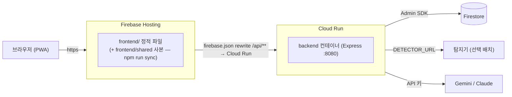
```mermaid
flowchart LR
  subgraph HOST["Firebase Hosting"]
    ST["frontend/ 정적 파일<br/>(+ frontend/shared 사본 — npm run sync)"]
  end
  subgraph RUN["Cloud Run"]
    BE["backend 컨테이너 (Express :8080)"]
  end
  U["브라우저 (PWA)"] -- "https" --> HOST
  HOST -- "firebase.json rewrite /api/** → Cloud Run" --> RUN
  RUN -- "Admin SDK" --> FS[("Firestore")]
  RUN -- "DETECTOR_URL" --> ML["탐지기 (선택 배치)"]
  RUN -- "API 키" --> LLM["Gemini / Claude"]
```

| 항목 | 내용 |
|---|---|
| 프론트 | Firebase Hosting — 정적 서빙. `/api/**` rewrite로 Cloud Run에 연결되어 개발 프록시와 **같은 출처 동작 동일** |
| 백엔드 | Cloud Run (Express 그대로 컨테이너화). SSE 유지 |
| 규칙·인덱스 | `firebase deploy --only firestore:rules` |
| 모바일 | Expo — 개발은 Expo Go, 배포 시 `EXPO_PUBLIC_FIRE_SERVER`로 서버 주소 고정. BLE 실측·연속 햅틱은 개발 빌드(네이티브)로 전환하며 교체 지점은 `scanOnce()`·`setEngine()` 두 곳뿐 |
| 시연 대안 | `npm start` 1포트 통합 실행 — 배포 없이 로컬에서 배포 구성과 동일 동작 확인 |

## 9.6 오프라인·캐시 정책 (sw.js)

| 대상 | 정책 | 이유 |
|---|---|---|
| 정적 자원 (html·js·shared) | Service Worker 캐시 | 오프라인에도 앱 구동 |
| `/api/*` | **캐시 금지** | 위험 상태·경로가 낡은 캐시로 답해지면 오안내가 된다 — 오프라인 판단·폴백은 앱 로직(`api.js`)이 명시적으로 수행하고 배지로 알린다 |
| 도면·위험 상태 | 앱 계층 캐시 (마지막 수신본) | 오프라인 폴백 계산의 입력 |

## 9.7 안전 고지 및 인증 한계

> ⚠️ 이 소프트웨어는 **모의대피 실험·UX 검증용 프로토타입**이며 재난안전 인증 제품이 아니다. 실제 화재 대응 용도로 사용해서는 안 된다. 공식 안전규칙 준수, 위치 인프라 실측, 당사자 실증, 책임·인증 체계는 후속 과제이며, 실연동을 위한 기술 경로(도면 주입 API·센서 웹훅)만 열어 두었다.

---

# 참고문헌

1. Anyplace — Univ. of Cyprus DMSL. POI/Connection 그래프 모델 및 `server/app/utils/Dijkstra.scala` 경로탐색 (MIT). https://github.com/dmsl/anyplace — `shared/pathfinding.js`로 포팅.
2. Visual_Slam — ravencore06 (Prototype/Academic, MIT). PWA 구조, devicemotion 걸음감지·방위추적, TTS·진동 접근성 모듈 참고. https://github.com/ravencore06/Visual_Slam
3. Dijkstra, E. W. (1959). A note on two problems in connexion with graphs. *Numerische Mathematik*, 1, 269–271.
4. Ultralytics YOLO Documentation. https://docs.ultralytics.com — 도면 기호 탐지 모델 학습·추론.
5. Google AI for Developers — Gemini API. https://ai.google.dev — 도면 이름·통로 판독.
6. Anthropic — Claude API Documentation. https://docs.anthropic.com — 도면 판독 대체 공급자.
7. Firebase Documentation — Firestore, Hosting, Security Rules. https://firebase.google.com/docs
8. Google Cloud Run Documentation. https://cloud.google.com/run/docs
9. MDN Web Docs — Server-Sent Events, Service Worker API, ARIA Live Regions, Web Bluetooth. https://developer.mozilla.org
10. Expo Documentation — expo-haptics, expo-camera, expo-sensors, expo-speech. https://docs.expo.dev
11. WAI-ARIA Authoring Practices — Accessible notification patterns (aria-live). W3C.
12. Bahl, P., & Padmanabhan, V. N. (2000). RADAR: An in-building RF-based user location and tracking system. *IEEE INFOCOM* — RSSI 기반 실내 측위의 오차 특성 참고.
